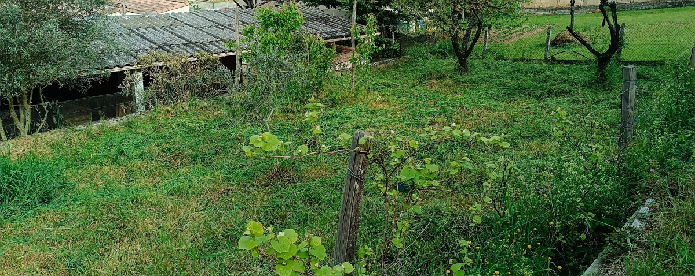

En 2024, [j’ai acheté ce coupe-bordure sans fil](https://www.amazon.fr/dp/B08LQHKBNT), car j’étais déjà équipé de batterie Einhell.

Il a super bien fonctionné pour mon ancienne propriété, même si les ronces et les pierres consomment beaucoup de lames plastiques…

## Nouvelle propriété, nouveaux problèmes

le 23 avril 2025, j’ai acheté cet [\*\*ensemble de couteaux en métal pour coupe-bordure sans fil](https://www.amazon.fr/dp/B088P29JFF) (et potentiellement [ces lames de rechanges](https://www.amazon.fr/dp/B0CZ3FPQ57)) pour le coupe-bordure, mais… ça consomme énormément de batteries par rapport à la lame plastique ! Et il faut faire vraiment attention aux pierres ou même aux branches dures qui trainent…

De plus, sur de l’herbe haute (> 20 cm), ça peine… et il faut donc « couper en étages ». Pas très efficace, je vous l’avoue…

Enefin, le terrain est accidenté, du coup j’hésite de commander une tondeuse, car :

- la solution thermique, ça sent mauvais et c’est coûteux à l’entretien…
- la solution électrique, ça semble compliqué en termes de performance sur plus de 500 m2…

Et là, je me suis souvenu d’une vidéo sur la chaîne « L’archipelle » où Brian [visitait quelqu’un en Dordogne](https://www.youtube.com/watch?v=mxFKWyC-4RI&t=2027s). Et cette personne, Theud Bald « Thibaud », est à fond sur les outils « sans pétrole » où la force humaine et un outil bien préparé suffisent pour donner vie à l’outil et le rendre efficace.

L’un de ces outils est la _faulx_ (ancienne écriture) ou faux. J’ai trouvé une autre vidéo où il explique [comment fabriquer son manche de faux avec une branche](https://www.youtube.com/watch?v=R-18PeBxoRM).

J’avais déjà en tête mes critères :

- simple d’utilisation,
- ne tombe pas en panne
- coupe l’herbe haute,
- le tout pour un prix entre 100 et 200 euros.

Et là, dans la seconde vidéo, j’ai vu le lien de la boutique de Thibaud : http://la-frontiere.fr/.

J’ai commandé [le modèle « *Lame Falci modèle 128 — La polyvalente* » (60 cm)](https://la-frontiere.fr/boutique/lame-de-faux-falci-modele-128-la-polyvalente) avec [le manche pour **_faux Falci Robuste_** de 150 cm](https://la-frontiere.fr/boutique/manche-de-faulx-falci-robuste) et [la pierre synthétique](https://la-frontiere.fr/boutique/pierre-a-faux-carborundum-qualite-silicar).

## Premier essai

Reçu le 27 avril 2025, je n’ai pas tardé à tester ma faux et BAM ! Je n’avais jamais utilisé cela avant et ça fonctionne d’entrée. Heureusement, je suis un faux gaucher et même avec cette faux de droitier, le mouvement en demi-lune de la droite vers la gauche m’a semblé naturel.

Alors, oui, d’entrée de jeu, mes filles m’ont dit : « ça ne coupe pas » l’herbe courte en premier regard. En effet, je n’ai pas vu l’efficacité que Thibaud montre dans la vidéo de l’Archipelle. Mais ça coupe quand même. J’observe une plus grande aisance sur l’herbe plus dure ou épaisse.

Aussi, peut-être que je n’ai pas assez bien aiguisé la lame ? Ou le terrain est trop irrégulier ? Thibaud indique qu’il faut utiliser la gravité de la Terre avant tout et de plaquer la lame au sol. Dans mon cas, j’avais un peu de mal…

Par contre, j’ai coupé 300-400 m2 de hautes herbes en une heure ! C’est satisfaisant !

## Conclusion

Pour un premier usage, je trouve que c’est un très bon achat ! Par contre, je n’ai pas encore le coup pour l’herbe basse pour couper aussi proprement que Thibaud ou que mon coupe-bordure.

Toutefois, maintenant que l’herbe est courte, le coupe-bordure passera beaucoup plus facilement.

Je coche donc toutes les cases :

- simple d’utilisation ✅
- ne tombe pas en panne ✅
- coupe l’herbe haute ✅
- le tout pour un prix entre 100 et 200 euros ✅ : j’ai payé 182,90 euros ports compris pour les 2 faux, le manche et la pierre.

Au passage, j’ai aussi commandé une lame plus courte, la [_faux Falci modèle 187 — La petite_ (35 cm)](https://la-frontiere.fr/boutique/lame-de-faux-falci-modele-187-la-petite), car je pense qu’elle sera utile sur les contours escarpés de ma propriété où aucune tondeuse ne passe et où l’herbe est très haute et les buissons nombreux.

À suivre…



Merci d’avoir lu cet article. Assurez-vous de [me suivre sur X](https://x.com/LitzlerJeremie), de [vous abonner à ma publication Substack](https://iamjeremie.substack.com/) et d’ajouter mon blog à vos favoris pour ne pas manquer les prochains articles.


