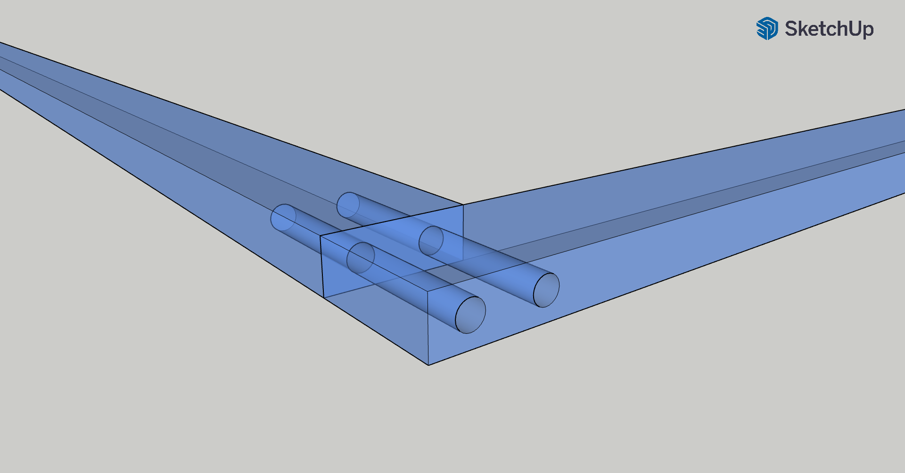

Comment construire des moustiquaires robustes soi-même pour un prix serré, c’est ce que je vous présente dans cet article moins technologique, mais tout aussi technique.

En plus, j’ai réutilisé de vieux tasseaux en bois suite au démontage de nombreuses cloisons en lambris et cela a réduit drastiquement le coût total.

Voici l’histoire de la réalisation.

## La question de départ

J’avais réalisé des moustiquaires dans mon ancienne maison avec [ce modèle en inox](https://www.amazon.fr/dp/B09HKKB6YB), bien plus résistant aux UV (mais fragile aux griffes de chats…).

Toutefois, les cadres demeuraient fixes, et cela ne nous dérangeait pas.

Dans notre nouvelle maison, nos volets en persienne en bois sont repliables, comme indiqué précédemment. Et j’ai eu l’idée de mettre les moustiquaires dans le cadre de la structure métallique.

Toutefois, comment réaliser un cadre solide à partir de mes tasseaux de récupération de 37 mm par 10 mm ?

Je connaissais quelques termes d’assemblage du bois, mais je ne voulais pas utiliser des équerres ou des vis.

J’ai pensé à Perplexity pour ébaucher des idées et choisir moi-même celle qui me semblait la plus réalisable.

Avec la requête « J’ai besoin de créer des cadres à partir de tasseaux en bois de 27 mm de largeur par 10 mm d’épais. Le cadre aura une dimension d’environ 125 cm par 61 cm », il m’a donné ces options :

> Pour assembler solidement des tasseaux de bois de 27 mm de largeur et 10 mm d’épaisseur afin de créer un cadre de 125 cm x 61 cm, plusieurs techniques sont possibles. Voici les options les plus adaptées :
>
> **1. Assemblage par collage**
>
> Le collage est une méthode simple et efficace pour assembler les tasseaux :
>
> - Appliquez une colle à bois vinylique sur les surfaces de contact.
> - Positionnez les pièces pour former un rectangle avec des angles parfaitement alignés.
> - Maintenez les joints avec des serre-joints pendant le séchage (plusieurs heures).
> - Pour renforcer l’assemblage, vous pouvez ajouter des clous fins ou des vis après le séchage
>
> **2. Assemblage à mi-bois**
>
> L’assemblage à mi-bois consiste à entailler chaque tasseau à mi-épaisseur pour qu’ils s’emboîtent parfaitement :
>
> - Tracez les repères pour les entailles.
> - Sciez et creusez à mi-épaisseur avec une scie ou une défonceuse.
> - Encollez les surfaces avant d’emboîter les éléments.
> - Serrez avec des serre-joints pour garantir la solidité.
>
> **3. Assemblage par tourillons**
>
> Les tourillons sont idéaux pour renforcer l’assemblage :
>
> - Percez des trous dans les extrémités des tasseaux à l’aide d’un gabarit de perçage.
> - Insérez des chevilles en bois (tourillons) encollées dans les trous.
> - Assemblez les pièces et maintenez-les avec des serre-joints pendant le séchage.
>
> **4. Assemblage à onglet**
>
> Pour une finition esthétique, vous pouvez couper les extrémités des tasseaux à un angle de 45° :
>
> - Utilisez une scie à onglet pour réaliser des coupes précises.
> - Appliquez de la colle sur les joints et fixez avec des serre-joints.
> - Renforcez avec des agrafes universelles ou des clous fins si nécessaire.
>
> **5. Utilisation du système DOMINO**
>
> Si vous disposez d’un outil spécifique comme le système DOMINO :
>
> - Fraisez des trous dans les extrémités des tasseaux.
> - Insérez des tenons encollés dans ces trous.
> - Assemblez et serrez avec des serre-joints pour obtenir un cadre robuste.

Pas trop fan de l’option par collage ou à onglet, car je ne trouvais pas cela très solide dans mon esprit. Idem pour le mi-bois.

Le système DOMINO ou de tourillons me semblait intéressant. De plus, [les baguettes tourillon de 1 m](https://www.entrepot-du-bricolage.fr/p/pr-tourillon-rond-bois-hetre-rabote-non-traite-diam-5-x-1000-mm-monnet-seve-295949) sur l’Entrepôt du Bricolage proche de chez moi sont très peu chères.

Je suis donc parti sur cette option.

Ensuite, j’ai décidé de placer les moustiquaires en 2 cadres dans le cadre du volet en _persienne_.

Pourquoi 2 cadres par fenêtre ? Pour faciliter l’installation et la désinstallation sur le cadre du volet en persienne. Si j’avais réalisé un cadre unique par fenêtre, cela aurait posé problème pour positionner les moustiquaires en raison du design même du cadre du volet.

## Positionner les tasseaux en un coin

Ce challenge m’a pris deux essais pour trouver la méthode adéquate.

Au premier essai, j’ai utilisé [une grosse pince à ressort](https://www.amazon.fr/Nirox-Jeu-pinces-%C3%A9tau-ressort-Serre-joints/dp/B0844GNX6C) pour caler ensemble le premier coin.

Crédit : image de la pince issue de Amazon.fr.

Sauf que la pince ne serrait pas assez. J’ai réussi à percer le premier coin et les suivants, mais ça prenait pas mal de temps.

Au second essai, j’ai décidé de reprendre mes pinces, mais cette fois-ci, j’ai préparé 2 cales en bois (chutes de tasseaux) et un serre-joint par coin.

Une fois assemblé, cela donne ceci :

Les cales permettent de prépositionner les tasseaux de l’angle, puis, avec le serre-joint, on vient visser fort à la jointure des deux tasseaux. Ainsi, ils ne bougent pas.

Voici le résultat final du cadre complet avant perçage :

Il faut bien vérifier que les angles sont droits et on est prêt à passer au perçage.

## Percer les tasseaux

Avec une mèche de 5 mm (soit la moitié de l’épaisseur du tasseau), je suis venu percer 54 mm (27 mm sur le côté du premier tasseau et 27 mm dans la longueur du second tasseau.

On s’assure d’effectuer le perçage bien droit et centré !

## Insérer les tourillons

L’étape suivante, on insère la baguette tourillon dans chaque trou.

Alors, là, ça dépend :

- soit la baguette glisse assez facilement et on n’a qu’à couper à ras le tasseau,
- soit on force un peu au début, puis on coupe assez long (max. 54 mm), on insère avec un marteau et on coupe le surplus.

Au final, le résultat est plutôt propre et remarquablement solide, surtout une fois les deux tourillon insérés.

## Fixer la moustiquaire sur le cadre

J’ai utilisé des [agrafes de 10 mm](https://www.amazon.fr/Rapid-construction-disolation-galvanis%C3%A9-performance/dp/B0002Z0206) pour [agrafeuse murale](https://www.amazon.fr/Agrafeuse-Rapid-Bricolage-Tapisserie-Ergonomique/dp/B0DTYDT29M). Ça permet de tenir solidement la moustiquaire en inox tous les 10 cm. Au niveau des jointures de tasseaux, j’ai mis 3 agrafes pour garantir une jonction durable.

Voilà !

## Conclusion

J’ai involontairement dimensionné les cadres 27 mm plus larges que celui du volet en persienne. L’avantage imprévu est que je n’ai pas de jour entre les cadres et je suis sûr de ne pas avoir de moustiques qui passent !

Vous aimez ?



Merci d’avoir lu cet article. Assurez-vous de [me suivre sur X](https://x.com/LitzlerJeremie), de [vous abonner à ma publication Substack](https://iamjeremie.substack.com/) et d’ajouter mon blog à vos favoris pour ne pas manquer les prochains articles.






