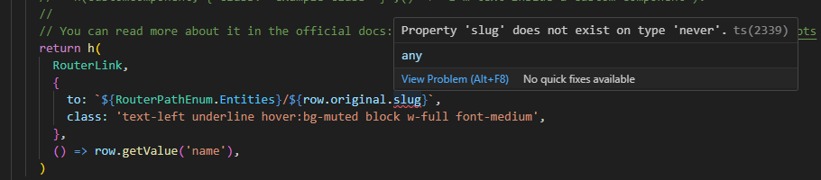
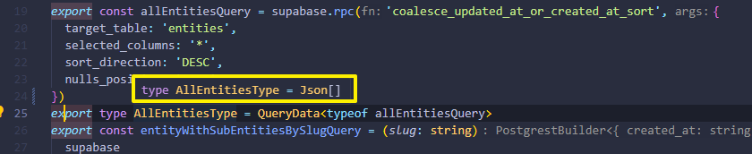

Le 29 janvier dernier, j’ai partagé une astuce pour [utiliser les fonctions Postgres](../../2025-01/la-clause-order-by-avec-supabase/index.md) pour effectuer un triage avancé sur une table.
Let me show you the error I didn’t catch right away.

## Le problème

Sur tout le code lié à `allEntitiesQuery`, de nombreuses erreurs TypeScript sont apparues.

La première que j’ai vue se trouvait dans la définition des colonnes de la _datable_ où TypeScript m’indiquait que les propriétés de `AllEntitiesType` n’existaient pas.



## La cause

La fonction RPC de Supabase retourne le type selon le type de retour de la fonction, tel que défini dans le schéma de votre base de données ([source](https://www.restack.io/docs/supabase-knowledge-supabase-rpc-typescript-guide)).

Dans mon cas, j’ai mis `RETURNS SETOF json AS $$` et c’est ce qui s’est passé :



Puisque vous pouvez appeler la fonction avec le nom de la table comme paramètre d’entrée, le type retourné me semble logique.

Mais ce type est trop vague pour que TypeScript infère les propriétés de l’objet.

## La solution

Pour résoudre ce problème, vous devez utiliser les types générés par Supabase et créer un nouveau type personnalisé :

```tsx
import type { Database } from "@/types/DatabaseTypes";

export type EntityRecordWithRpc =
  Database["public"]["Tables"]["entities"]["Row"];
```

Ensuite, vous mettez à jour le type retourné en `as unknown as PostgrestSingleResponse<EntityRecordWithRpc[]>` sur le `allEntitiesQuery`.

Le TypeScript requiert la conversion `as unknown` en premier avant le `as PostgrestSingleResponse<EntityRecordWithRpc[]>` parce qu’aucun type ne se superpose suffisamment à l’autre (règle _ts(2352)_).

Ensuite, remplacez toutes les références de `AllEntitiesTypes` par `EntityRecordWithRpc`.

Terminez par une nouvelle exécution du script de compilation et aucune erreur TypeScript !

## Conclusion

Ce que j’en retiens : je dois ajouter une étape de CI pour exécuter le `npm run build` sur chaque PR. Un sujet pour un autre article.



Merci d'avoir lu cet article. Assurez-vous de [me suivre sur X](https://x.com/LitzlerJeremie), de [vous abonner à ma publication Substack](https://iamjeremie.substack.com/) et d'ajouter mon blog à vos favoris pour ne pas manquer les prochains articles.



Photo by [Mido Makasardi ©️](https://www.pexels.com/photo/red-led-traffic-cone-2743739/)
