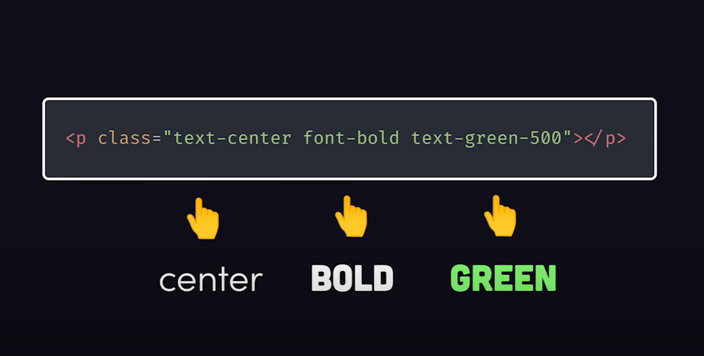

Que vous aimiez son approche axée sur les classes utilitaires ou que vous détestiez ses listes de classes encombrées dans de l’HTML, Tailwind CSS suscite des opinions très tranchées parmi les développeurs.

Examinons de plus près ce qui le rend à la fois puissant et controversé.

## Tailwind CSS en vaut-il la peine ?

Franchement, la première chose qui m’a frappé, c’est le code HTML vraiment brouillé, comme beaucoup d’entre vous, j’en suis sûr. Il y a tellement de classes CSS !

Cependant, [voici les problèmes](https://www.youtube.com/watch?v=lHZwlzOUOZ4) qu’il tente de résoudre en utilisant du CSS standard, selon [Fireship](https://www.youtube.com/@Fireship) :

- Colocation :
  - Avec le CSS classique, nous avons décidé d’appliquer une séparation des responsabilités entre le balisage (HTML) et les styles (CSS). Cela nécessite de nommer les classes, ce que nous, les humains, ne savons pas bien faire. De plus, le nom de la classe ne vous renseigne pas sur les styles qui se cachent derrière.
  - Avec Tailwind, nous utilisons des classes utilitaires qui explicitent les styles dans le balisage. C’est ce qui crée le HTML brut qui affiche un attribut de classe avec des tonnes de classes, on est d’accord…
- Verbosité
  - Avec le CSS classique, la verbosité est une réalité. Par exemple, pour positionner un élément, vous devez définir les propriétés `position`, `top`, `right`, `bottom` et `left`.
  - Avec Tailwind, il suffit d’utiliser `inset-0`, vous n'avez pas besoin d'écrire toutes ces propriétés.
- Trop de puissance
  - Avec le CSS vanilla, vous avez trop de contrôle sur l'interface utilisateur, et si vous ne comprenez pas bien le fonctionnement du CSS, vous pouvez en souffrir.
  - Avec Tailwind, nous nous situons à mi-chemin entre le CSS vanille (utilisant la convention) et Bootstrap (utilisant la configuration).
- Zombies
  - Avec le CSS vanilla, il est fort probable que vous écriviez des styles qui ne seront pas utilisés ou qui deviendront inutilisés lorsque vous mettrez à jour le balisage.
  - Avec Tailwind, comme il est intégré au paquet CSS, l'étape de compilation purgera automatiquement le CSS dont l'application n'a pas besoin.

Au final, soit vous l'appréciez et vous l'utilisez, soit vous ne l'appréciez pas et vous ne l'utilisez pas. Point final.

Mais avant de nous plonger dans la liste des problèmes, comprenez bien qu'utiliser un outil tel que Tailwind CSS vous empêchera de revenir à vos anciennes méthodes.

Pourquoi ? Parce qu'il vous fera gagner du temps.

Allons-y.

## Les problèmes que Tailwind tente de résoudre

### Séparation des responsabilités

Depuis 20 ans, la norme consiste à séparer le balisage du style. Cela nécessite de nommer les classes CSS que vous verrez dans le HTML (ce qui est difficile).

Mais, plus important encore, quelques semaines ou mois plus tard, lorsque vous revenez sur votre code, vous avez oublié quel style est appliqué à ces classes rien qu'en regardant le HTML. Vous devez donc revenir aux styles.

De plus, vous pouvez utiliser ces classes CSS à plusieurs endroits et modifier leur style pourrait causer des dysfonctionnements là où vous ne vous y attendez pas...

Avec Tailwind CSS, vous n'avez pas ce problème.

C'est vrai, cela peut donner lieu à du code HTML surchargé, que nous avons tous vu et qui nous fait dire : « BURK ! »

Avec Visual Studio Code, vous pouvez utiliser l'extension nommée « Inline fold » pour plier et déplier cette liste de classes Tailwind.

Vous pouvez également utiliser le regroupement avec la directive `@apply` dans le CSS de votre composant. Toutefois, cela ne résoudra pas le problème du code HTML brouillé lorsque vous consultez le code HTML dans les outils de développement de votre navigateur. En effet, le code généré contiendra la longue liste de classes CSS.

### Verbosité

Le CSS est verbeux. Avec les classes Tailwind CSS, vous tapez beaucoup plus de caractères.

Oui, il est toujours préférable d’utiliser directement la plateforme. Avec Tailwind CSS, vous devez apprendre une abstraction en plus du CSS. Cela représente un travail supplémentaire si vous débutez.

Je dirais qu’il faut bien comprendre le CSS avant de décider d’utiliser Tailwind CSS.

### Trop de pouvoir

Le CSS vous donne trop de contrôle sur l’interface utilisateur. Et vous connaissez probablement BootStrap, n’est-ce pas ? Eh bien, il est difficile à personnaliser et n’offre pas suffisamment de flexibilité.

Tailwind CSS est le compromis entre ces deux solutions.

Il fournit un ensemble standard de contraintes que vous pouvez utiliser pour concevoir une interface utilisateur esthétique et cohérente.

### Zombies

Qui a déjà écrit une classe CSS qui, finalement, devient non utilisée ? Je suis coupable.

Avec Tailwind CSS, vous savez que l’outil supprimera tout ce que vous n’utilisez pas, générant ainsi un ensemble de code CSS plus compact au final.

Oui, l’inconvénient est de suivre au moins 5 étapes pour configurer Tailwind CSS dans votre projet. Il peut donc être préférable de l’utiliser pour des projets de grande envergure.

Pour les projets plus modestes, pensez à [PicoCss](https://picocss.com/). Je donnerai mon avis sur ce framework plus tard si je l’utilise.

## Ma conclusion : apprenez le CSS avant d’apprendre Tailwind CSS

Lorsque j’ai découvert Tailwind CSS, après quelques semaines d’utilisation, je me suis dit :

> Il faut absolument comprendre le CSS pour bien l’utiliser.

Si vous ne comprenez pas Flexbox ou Grid par exemple, vous ne saurez pas comment utiliser les classes Flexbox ou Grid de Tailwind CSS. Et ainsi de suite…

C’est également ce que [Web Dev Simplified](https://www.youtube.com/@WebDevSimplified) recommande aux développeurs web.

## Sources consultées pour cet article

- [Tailwind CSS est le pire, de Fireship](https://www.youtube.com/watch?v=lHZwlzOUOZ4)
- [Pourquoi les développeurs HAïSSENT TailwindCSS, de James Luterek](https://www.youtube.com/watch?v=mznsLAWVnOI)
- [Devriez-vous utiliser Tailwind CSS, de Web Dev Simplified](https://www.youtube.com/watch?v=hdGsFpZ0J2E)



Merci d'avoir lu cet article. Assurez-vous de [me suivre sur X](https://x.com/LitzlerJeremie), de [vous abonner à ma publication Substack](https://iamjeremie.substack.com/) et d'ajouter mon blog à vos favoris pour ne pas manquer les prochains articles.


