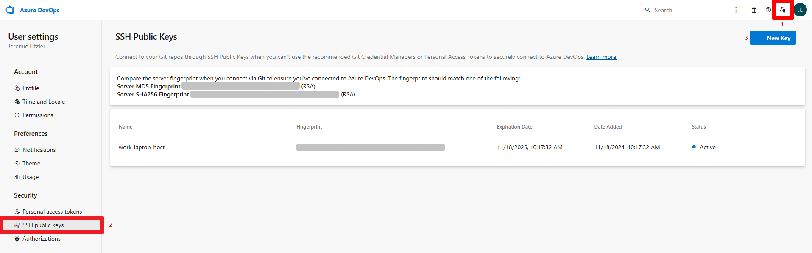
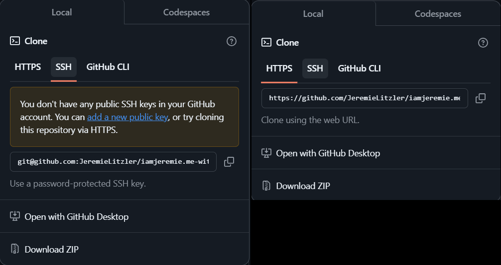

Utiliser une clé SSH pour cloner un dépôt peut parfois être la seule solution possible.

Voyons comment cela fonctionne et quel est le petit inconvénient lié à cette méthode.

## Types de clés recommandés

Les deux algorithmes de génération de clés SSH les plus populaires sont :

- **RSA** : largement pris en charge, mais moins sécurisé.
- **Ed25519** : plus puissant sur le plan cryptographique, recommandé pour les systèmes modernes.





## Génération d’une clé SSH

Ouvrez un terminal et exécutez :

```bash
# Accédez au répertoire racine de l'utilisateur.
cd

# Créez le répertoire .ssh
mkdir .ssh
# et naviguez-y.
cd .ssh

# Choisissez la version en fonction du système sur lequel vous souhaitez l'utiliser.
# Pour bénéficier de la sécurité la plus récente.
bashssh-keygen -t ed25519 -C "your_email@example.com"

# Ou pour une compatibilité plus large
bashssh-keygen -t rsa -b 4096 -C "your_email@example.com"

# Copiez la clé publique. Vous devrez l'ajouter aux paramètres du référentiel ou à votre système de gestion des versions.
cat id_rsa.pub # ou quel que soit le nom que vous avez donné à votre clé.
```

## Processus de génération de clé

1. Lorsque vous êtes invité à « Entrer le fichier dans lequel enregistrer la clé », appuyez sur Entrée pour accepter l’emplacement par défaut ou saisissez le nom souhaité (par ex. `id_rsa_my_great_app`).
2. Vous serez invité à entrer une phrase secrète :
   - **Recommandé** : ajoutez une phrase secrète pour plus de sécurité.
   - **Facultatif** : appuyez sur Entrée pour ignorer la phrase secrète.

## Emplacement de la clé

L’emplacement par défaut sera le répertoire actuel dans lequel vous exécutez la commande de création de clé. Il est recommandé de générer les clés dans le dossier `.ssh`.

## Après la génération

Une **clé privée** et une **clé publique** seront créées.

Le fichier de clé publique aura une extension `.pub` suffixant le nom saisi pour la clé.

**Gardez votre clé privée secrète et en sécurité**.

## Étapes suivantes

Utilisez la clé publique (dans notre exemple `id_rsa_my_great_app.pub`) lors de la configuration de l’accès SSH sur des services tels qu’Azure DevOps, GitHub, GitLab ou des serveurs distants.

Par exemple, dans Azure DevOps :



1. Cliquez sur le menu « *Clés publiques SSH* » dans le menu en haut à droite.
2. Vous devriez arriver sur la page « *Clés publiques SSH* ».
3. Ajoutez une nouvelle clé via « *Nouvelle clé* », nommez la clé et collez la clé publique.

Vous pouvez afficher le contenu de la clé publique à l’aide de : `cat ~/.ssh/id_rsa_my_great_app.pub`.

## Enregistrer la clé SSH

Le problème qui peut se poser est que, dans le cas d’Azure DevOps, la clé SSH n’est pas utilisée pour accepter les commandes Git.

Dans de nombreux référentiels, vous pouvez cloner à l’aide de HTTPS et SSH :



L’utilisation de HTTPS nécessite généralement des identifiants de connexion et un mot de passe. Avec Azure DevOps, cela n’est pas toujours possible.

L’utilisation de SSH nécessite des clés SSH : la clé publique est connue du serveur et vous détenez la clé privée.

J’ai rencontré un problème où, même si le serveur connaissait la clé publique, la commande Git pour cloner ne récupérait pas la clé SSH.

Pour résoudre ce problème, vous devez explicitement demander au client SSH d’enregistrer la nouvelle clé créée :

```bash
# Démarrer l'agent SSH
eval "$(ssh-agent -s)"
# Enregistrer la clé SSH
ssh-add ~/.ssh/id_rsa_my_great_app
```

Si vous devez souvent exécuter cette commande, ajoutez un alias Git :

```bash
# In your .gitconfig file located in /c/Users/YourUser directory
[alias]
    ssh = ! eval "$(ssh-agent -s)" && ssh-add ~/.ssh/id_rsa_my_great_app
```

C’est tout pour aujourd’hui.



Merci d’avoir lu cet article. Assurez-vous de [me suivre sur X](https://x.com/LitzlerJeremie), de [vous abonner à ma publication Substack](https://iamjeremie.substack.com/) et d’ajouter mon blog à vos favoris pour ne pas manquer les prochains articles.



Photo de [Thirdman](https://www.pexels.com/photo/shadow-of-a-hand-holding-a-key-on-wall-8470839/).
