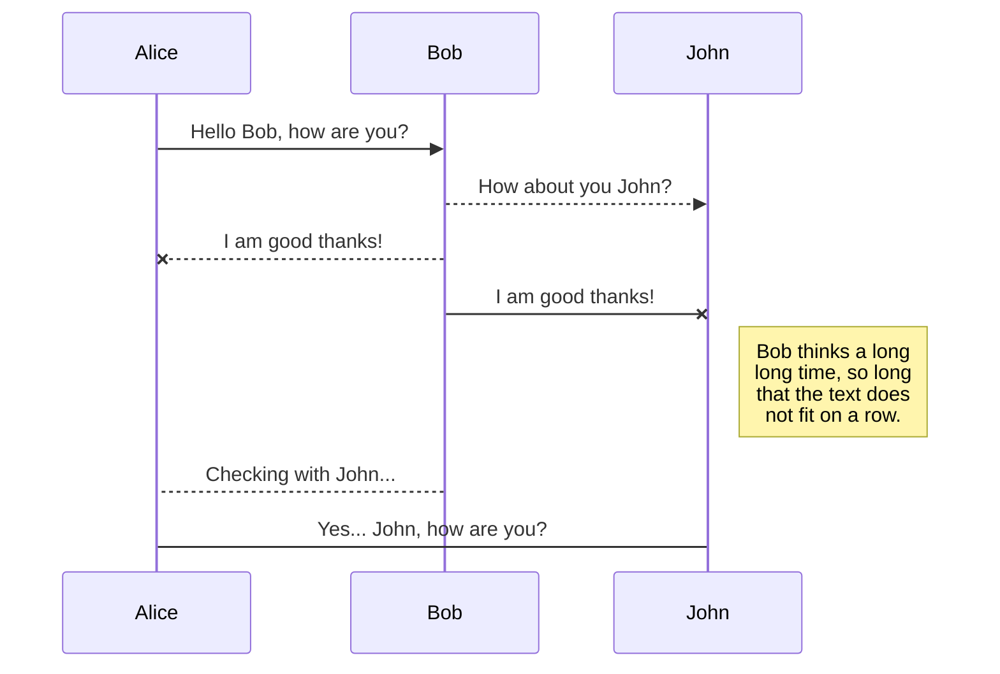

Il n'y a pas si longtemps, la création de diagrammes était très différente. Vous connaissez sûrement Lucidchart, draw.io. Puis, Mermaid Diagrams est arrivé.

Voyons comment cela fonctionne ci-dessous.

## Qu'est-ce que _Mermaid Diagrams_ ?

_Mermaid Diagrams_ est un outil de création de diagrammes et de graphiques basé sur JavaScript, créé par Knut Sveidqvist en 2014. Il l'a développé par frustration face aux outils existants pour créer des diagrammes dans la documentation.

### Pourquoi existe-t-il ?

Mermaid résout le problème principal : les outils traditionnels de création de diagrammes vous obligent à utiliser des applications distinctes (comme Visio, Lucidchart ou draw.io), à exporter des images, puis à les intégrer dans votre documentation.

Cela pose plusieurs problèmes :

- les diagrammes deviennent obsolètes lorsque le code ou le métier change,
- ils sont difficiles à versionner dans votre référentiel si vous utilisez Git,
- leur mise à jour nécessite de passer d'un outil à l'autre.

La solution de Mermaid est élégante : vous écrivez des diagrammes en utilisant une syntaxe textuelle simple directement dans vos fichiers Markdown et ils s'affichent sous forme de diagrammes visuels.

Par exemple, vous pouvez décrire un organigramme ou un diagramme de séquence en texte brut, et il génère automatiquement la représentation visuelle.

### Principaux avantages

Pour moi, l'avantage le plus intéressant est que les diagrammes Mermaid s'intégrent naturellement **un système de contrôle de version**. Comme les diagrammes ne sont que du texte, ils fonctionnent parfaitement avec Git et d'autres systèmes de contrôle de versions. Plus de conflicts à résoudre sur des fichiers binaires...

Cela en fait une **documentation vivante**. Les diagrammes peuvent être mis à jour aussi facilement que l'on édite du texte, ce qui augmente les chances qu'ils restent à jour.

De plus, ils offrent une bonne **accessibilité**. Toute personne capable d'écrire en Markdown peut créer des diagrammes sans avoir à apprendre à utiliser des outils de dessin complexes.

Enfin, leur **intégration** s'est généralisée. Ils fonctionnent dans les fichiers Markdown, les wikis, les sites de documentation et ont été adoptés par des plateformes telles que GitHub, GitLab, Azure DevOps et Notion. Je ne dirais pas que cela se fait toujours sans heurts ou que toutes les possibilités disponibles sur [le site Mermaid Diagrams](https://mermaid.ai/) sont utilisables, mais c'est possible. La preuve va vous être donné plus bas.

Mermaid est devenu particulièrement populaire auprès des équipes de développement logiciel, où il est crucial de synchroniser la documentation avec le code et où les développeurs préfèrent travailler dans des formats textuels.

## Exemple

Voici la démo en direct.

Le code Markdown suivant :

````md

````

devient :


Merci à [delize](https://github.com/delize) pour ses contributions dans [le ticket n° 1213](https://github.com/CaiJimmy/hugo-theme-stack/issues/1213) du thème de CaiJimmy afin de corriger la mise en œuvre initiale fournie dans la version 3.33.0 du thème.

Remarque : je dois encore corriger le style du mode sombre. Le passage en mode clair rendra donc le diagramme lisible. Merci de votre patience.



Merci d’avoir lu cet article. Assurez-vous de [me suivre sur X](https://x.com/LitzlerJeremie), de [vous abonner à ma publication Substack](https://iamjeremie.substack.com/) et d’ajouter mon blog à vos favoris pour ne pas manquer les prochains articles.



Crédit: Image issue [du site officiel de Mermaid Diagrams](https://mermaid.js.org).
