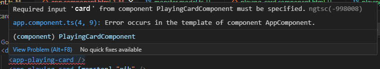

J’aime beaucoup Vue.js, mais apprendre un autre framework JavaScript peut m’être utile dans les missions auxquelles je participe.

J’ai décidé d’approfondir mes connaissances d’Angular grâce à un cours YouTube de 4 heures.

Le cours est basé sur Angular 17, mais j’ai travaillé avec Angular 19 au moment où je l’ai suivi, ce qui m’a permis de me familiariser avec l’API plus récente fournie par Angular.

## Installation de l’environnement de développement

### Installer NodeJS

Pour Windows, utilisez Scoop :

```powershell
scoop install main/nodejs-lts
```

Remarque : installez la version LTS pour éviter les messages « *Avertissement : la version actuelle de Node (23.9.0) n’est pas prise en charge par Angular* » provenant d’Angular à l’étape suivante.

### Installer Angular

```bash
npm install -g @angular/cli
ng version
# Doit afficher la dernière version d'Angular.
```

**IMPORTANT :** Au moment où j’ai écrit ces lignes, Angular était à la version 19, alors que le cours a été dispensé dans Angular 17 et 18.

### Extensions VSCode

Personnellement, j’utilise les extensions suivantes :

- [https://marketplace.visualstudio.com/items?itemName=1tontech.angular-material](https://marketplace.visualstudio.com/items?itemName=1tontech.angular-material)
- [https://marketplace.visualstudio.com/items?itemName=alexiv.vscode-angular2-files](https://marketplace.visualstudio.com/items?itemName=alexiv.vscode-angular2-files)
- [https://marketplace.visualstudio.com/items?itemName=bradlc.vscode-tailwindcss](https://marketplace.visualstudio.com/items?itemName=bradlc.vscode-tailwindcss)
- [https://marketplace.visualstudio.com/items?itemName=christian-kohler.path-intellisense](https://marketplace.visualstudio.com/items?itemName=christian-kohler.path-intellisense)
- [https://marketplace.visualstudio.com/items?itemName=cyrilletuzi.angular-schematics](https://marketplace.visualstudio.com/items?itemName=cyrilletuzi.angular-schematics)
- [https://marketplace.visualstudio.com/items?itemName=dbaeumer.vscode-eslint](https://marketplace.visualstudio.com/items?itemName=dbaeumer.vscode-eslint)
- [https://marketplace.visualstudio.com/items?itemName=editorconfig.editorconfig](https://marketplace.visualstudio.com/items?itemName=editorconfig.editorconfig)
- [https://marketplace.visualstudio.com/items?itemName=formulahendry.auto-close-tag](https://marketplace.visualstudio.com/items?itemName=formulahendry.auto-close-tag)
- [https://marketplace.visualstudio.com/items?itemName=formulahendry.auto-rename-tag](https://marketplace.visualstudio.com/items?itemName=formulahendry.auto-rename-tag)
- [https://marketplace.visualstudio.com/items?itemName=gruntfuggly.todo-tree](https://marketplace.visualstudio.com/items?itemName=gruntfuggly.todo-tree)
- [https://marketplace.visualstudio.com/items?itemName=humao.rest-client](https://marketplace.visualstudio.com/items?itemName=humao.rest-client)
- [https://marketplace.visualstudio.com/items?itemName=infinity1207.angular2-switcher](https://marketplace.visualstudio.com/items?itemName=infinity1207.angular2-switcher)
- [https://marketplace.visualstudio.com/items?itemName=john-crowson.angular-file-changer](https://marketplace.visualstudio.com/items?itemName=john-crowson.angular-file-changer)
- [https://marketplace.visualstudio.com/items?itemName=loiane.angular-extension-pack](https://marketplace.visualstudio.com/items?itemName=loiane.angular-extension-pack)
- [https://marketplace.visualstudio.com/items?itemName=obenjiro.arrr](https://marketplace.visualstudio.com/items?itemName=obenjiro.arrr)
- [https://marketplace.visualstudio.com/items?itemName=patbenatar.advanced-new-file](https://marketplace.visualstudio.com/items?itemName=patbenatar.advanced-new-file)
- [https://marketplace.visualstudio.com/items?itemName=pucelle.vscode-css-navigation](https://marketplace.visualstudio.com/items?itemName=pucelle.vscode-css-navigation)
- [https://marketplace.visualstudio.com/items?itemName=quicktype.quicktype](https://marketplace.visualstudio.com/items?itemName=quicktype.quicktype)
- [https://marketplace.visualstudio.com/items?itemName=rctay.karma-problem-matcher](https://marketplace.visualstudio.com/items?itemName=rctay.karma-problem-matcher)
- [https://marketplace.visualstudio.com/items?itemName=segerdekort.angular-cli](https://marketplace.visualstudio.com/items?itemName=segerdekort.angular-cli)
- [https://marketplace.visualstudio.com/items?itemName=simontest.simontest](https://marketplace.visualstudio.com/items?itemName=simontest.simontest)
- [https://marketplace.visualstudio.com/items?itemName=steoates.autoimport](https://marketplace.visualstudio.com/items?itemName=steoates.autoimport)
- [https://marketplace.visualstudio.com/items?itemName=stringham.move-ts](https://marketplace.visualstudio.com/items?itemName=stringham.move-ts)
- [https://marketplace.visualstudio.com/items?itemName=techer.open-in-browser](https://marketplace.visualstudio.com/items?itemName=techer.open-in-browser)
- [https://marketplace.visualstudio.com/items?itemName=wix.vscode-import-cost](https://marketplace.visualstudio.com/items?itemName=wix.vscode-import-cost)

### Créer le projet

```bash
ng new project-name
```

Voir [mes notes concernant le dossier `assets` supprimé sous `src`](https://github.com/JeremieLitzler/angular-course-with-simpletech/blob/main/playing-cards/public/assets/README.md).

## Les composants

Pour créer un composant, utilisez cette commande :

```bash
# forme abrégée de `ng generate component components/playing-card`
ng g c components/playing-card
```

Ce qui précède crée un nouveau sous-dossier `components/playing-card` sous `app`. Le composant échafaudé est défini avec les fichiers `.css`, `.html`, `ts` et `spec.ts`.

Pour ignorer la génération des fichiers de test, il suffit d’ajouter le drapeau `--skip-tests` à la commande ci-dessus.

## Entrées et signaux d’entrée

La première manière de déclarer des entrées utilise le décorateur :

```tsx
  @Input() name: string = 'Default Name';
```

Vous pouvez ensuite l’utiliser dans le composant parent qui l’utilise :

```html
<app-playing-card name="My custom name" />
```

Cependant, j’ai appris que, si vous définissez une entrée avec un type différent d’une `chaîne`, alors vous devez utiliser le `[ ]`.

Par exemple :

```html
<app-playing-card [hp]="20" />
```

Il peut également contenir une simple expression JavaScript :

```html
<!-- will output 54 as HP value -->
<app-playing-card [hp]="20+34" />
```

De même, nous pouvons transmettre des objets :

```html
<app-playing-card [card]="pik" />
```

Pour fonctionner, vous devriez utiliser la bonne pratique de créer une classe `model` que vous utilisez pour initialiser `pik` et définir le type d’entrée de `app-playing-card` avec le nom de la classe.

Par exemple, je pourrais avoir cette classe :

```tsx
export class Card {
  // le type est déduit puisque nous n'utilisons que des primitives dans cet exemple
  name = "Default Card Name";
  hp = 40;
  figureCaption = "Default Card figure caption";
  attackName = "Default Attack name";
  attackStrength = 60;
  attackDesc = "Default Attack description";
}
```

Je l’utilise pour déclarer `pik` dans mon `app.component` :

```tsx
export class AppComponent {
  pik!: Card;

  constructor() {
    this.pik = {
      name: "Pikachou",
      hp: 100,
      attackDesc: "Pikachou strikes !!!",
      attackName: "Strike",
      attackStrength: 40,
      figureCaption: "The famous one",
    };
  }
}
```


Le `!` est l’opérateur d’assertion de l’assignation définie.

Il indique au compilateur TypeScript « *Je sais que cette propriété semble ne pas être initialisée, mais faites-moi confiance, une valeur lui sera attribuée avant qu’elle ne soit utilisée* ».

Sans lui, TypeScript émettrait une erreur, car l’objet `pik` est déclaré, mais n’est pas immédiatement initialisé lors de la déclaration. Puisque vous l’assignez au constructeur, le `!` supprime cette erreur.



Et je l’utilise pour saisir les données du composant de mon enfant :

```tsx
export class PlayingCardComponent {
  @Input() card: Card = new Card();
}
```

Une autre caractéristique du décorateur `@Input` est sa configuration : vous pouvez faire en sorte que l’entrée de la carte soit requise :

```tsx
  @Input({
    required: true,
  })
  card: Card = new Card();
```

Et TypeScript vous dira ce qui suit :



Vous pouvez personnaliser le nom de l’attribut avec `alias` ou transformer votre objet d’entrée avec `transform`, mais je ne vois pas de bon cas d’utilisation pour donner un exemple pour cela.

Maintenant, depuis Angular 17, vous pouvez utiliser les signaux d’entrée de la manière suivante :

```tsx
export class PlayingCardComponent {
  card: InputSignal<Card> = input(new Card());
}
```

Dans le code HTML, vous devrez ajouter `()` pour accéder aux propriétés de l’entrée.

```html
<!-- With @Input() -->
<div id="name">{{ card.name }}</div>
<!-- With signal input -->
<div id="name">{{ card().name }}</div>
```

## Sorties, signaux de sorties et modèles

Lorsque nous avons besoin de communiquer des données d’un composant enfant à son parent, nous pouvons utiliser le décorateur `@Output`. Nous l’appelons aussi _événement émis_.

Un exemple très simple ressemblerait à ceci :

```tsx
// dans le fichier TS de votre composant enfant
// vous déclarez la sortie
@Output() searchButtonClicked = new EventEmitter() ;

// vous déclarez la méthode qui déclenche l'émission.
searchClick() {
   this.searchButtonClicked.emit() ;
}
```

Dans le fichier HTML du composant de votre enfant, vous pouvez ajouter le `searchClick` à un bouton :

```html
<button (click)="searchClick()">
  
</button>
```

Ensuite, dans le fichier TS de votre composant parent, vous ajoutez une propriété `searchClickCount` initialisée à 0 et vous pouvez écouter les événements et imprimer la valeur `searchClickCount` mise à jour.

```html
<app-search-bar (searchButtonClicked)="increaseCount()" />
<p>Search click count: {{ searchClickCount }}</p>
```

Souvent, nous transmettons les données vers le haut de la hiérarchie des composants, ce qui n’est pas le cas dans l’exemple ci-dessus.

Disons que nous voulons afficher le terme recherché dans le composant parent.

Nous devons d’abord mettre à jour le fichier TS du composant enfant :

```tsx
  @Input() searchTerm = '';
  @Output() searchTermChange = new EventEmitter<string>();

  updateSearch(value: string) {
    this.searchTermChange.emit(value);
  }
```

Ensuite, nous mettons à jour le fichier HTML du composant enfant pour utiliser `searchTerm` avec la directive `[ngModel]` :

```html
<input
  type="text"
  placeholder="Search..."
  [ngModel]="searchTerm"
  (ngModelChange)="updateSearch($event)"
/>
```

Enfin, nous ajoutons la propriété `searchedTerm = $event` au composant parent pour compléter la **liaison bidirectionnelle des données** et nous terminons par la mise à jour du fichier HTML du composant parent :

```html
<app-search-bar
  (searchButtonClicked)="increaseCount()"
  [searchTerm]="searchedTerm"
  (searchTermChange)="searchedTerm = $event"
/>
```

Cependant, nous pouvons raccourcir ce code comme suit :

```html
<app-search-bar [(searchTerm)]="searchedTerm" />
<p>Search term: {{ searchedTerm }}</p>
```

Ceci n'est possible que parce que la sortie dans le composant enfant est nommée comme l'entrée avec le préfixe `Change`. Angular vous indiquera si vous utilisez la version courte de manière incorrecte.

De la même manière que pour les entrées, à partir d'Angular 17.3, vous pouvez utiliser la nouvelle méthode avec les signaux de sortie :

```tsx
searchTerm = input<string>();
searchTermChange = output<string>();
searchButtonClicked = output();
```

Tout le reste du code ne change pas.

Depuis Angular 17.2, vous pouvez également simplifier encore plus le code en utilisant `model`. Dans votre fichier TS, le composant enfant deviendrait :

```tsx
  searchTerm = model<string>();
  updateSearch(value: string) {
    this.searchTerm.set(value);
  }
```

Dans le code HTML, vous pouvez modifier le code comme suit grâce à la liaison bidirectionnelle des données avec la directive `[(ngModel)]` :

```html
<input type="text" placeholder="Search..." [(ngModel)]="searchTerm" />
```

Vous pouvez ainsi supprimer la méthode `updateSearch`.

## Détecter les changements

Angular a plusieurs méthodes de cycle de vie sur les composants qui vous aident à initialiser un composant et à exécuter la logique sur les changements.

Vous pouvez trouver la [liste complète dans la documentation](https://angular.dev/guide/components/lifecycle).

### Stratégie par défaut vs `OnPush`

Par défaut, lorsqu'un événement est déclenché sur un composant, Angular vérifie toute l'arborescence du composant.

Cela peut causer des problèmes de performance sur une grande application.

C'est alors que vous pouvez utiliser la stratégie `OnPush`. Cela limite Angular à ne vérifier les composants `OnPush` que lorsque leurs entrées changent, qu'un événement se produit en leur sein, ou qu'un observable lié émet - en sautant les vérifications inutiles dans le cas contraire.

Sergio, auteur du cours que j'ai suivi, l'explique très bien [dans cette section du cours](https://youtu.be/U71TQN68QGU?si=lBZl7qu4OXhGMMWa&t=5610). Si vous ne parlez pas français, activez la fonction de traduction automatique des sous-titres sur YouTube.

### Signaux dans Angular

Venant de Vue.js, j'ai l'impression qu'Angular a pris le meilleur de la réactivité de Vue avec les primitives de signaux que vous pouvez utiliser à partir d'Angular 16 :

- `signal()` ≈ `ref()` dans Vue, les deux créent des primitives réactives.
- `computed(() => {})` : est-ce un copier-coller de Vue ? En tout cas, le fonctionnement et la syntaxe sont identiques.
- `effect()` ≈ `watchEffect()` (pas watch) qui s'exécute automatiquement lorsque les dépendances changent.

Par exemple, disons que nous stockons un index sélectionné dans un signal et un objet dans un computed qui change lorsque l'index change :

```tsx
  selectedIndex = signal<number>(1);
  selectedCard = computed<Card>(
    () => this.cards[this.selectedIndex()],
  );

  // Pas d'assignation directe mais une utilisation de `set` sur la propriété du signal.
  toggleCard() {
    this.selectedIndex.set(
      (this.selectedIndex() + 1) % this.cards.length,
    );
  }
```

Ensuite, dans le HTML, nous pouvons changer :

```html
<!-- sans signal ni computed -->
<app-playing-card [card]="cards[selectedIndex]" />
```

to

```html
<!-- avec signal ou computed -->
<app-playing-card [card]="selectedCard()" />
```

L'utilisation de signaux rend le code plus propre et plus court. Par exemple, le TypeScript était le suivant en utilisant la méthode historique :

```tsx
import {
  Component,
  input,
  OnChanges,
  OnInit,
  SimpleChanges,
} from "@angular/core";
import { Card } from "../../models/card.model";
import { CardTypeProperties } from "../../utils/card.utils";

@Component({
  selector: "app-playing-card",
  imports: [],
  templateUrl: "./playing-card.component.html",
  styleUrl: "./playing-card.component.css",
})
export class PlayingCardComponent implements OnInit, OnChanges {
  card = input(new Card());
  cardTypeIcon!: string;
  backgroundColor!: string;

  ngOnInit(): void {
    this.setIcon();
    this.setBackgroundColor();
  }
  ngOnChanges(changes: SimpleChanges): void {
    if (!changes["card"]) {
      return;
    }
    if (
      changes["card"].previousValue?.type === changes["card"].currentValue.type
    ) {
      return;
    }
    this.setIcon();
    this.setBackgroundColor();
  }

  setIcon() {
    this.cardTypeIcon = CardTypeProperties[this.card().type].iconUrl;
  }
  setBackgroundColor() {
    console.log(`color is ${CardTypeProperties[this.card().type].color}`);
    this.backgroundColor = CardTypeProperties[this.card().type].color;
  }
}
```

Avec les signaux et en gardant la même fonctionnalité, nous avons :

```tsx
import { Component, computed, input } from "@angular/core";
import { Card } from "../../models/card.model";
import { CardTypeProperties } from "../../utils/card.utils";

@Component({
  selector: "app-playing-card",
  imports: [],
  templateUrl: "./playing-card.component.html",
  styleUrl: "./playing-card.component.css",
})
export class PlayingCardComponent {
  card = input(new Card());
  cardTypeIcon = computed(() => CardTypeProperties[this.card().type].iconUrl);
  backgroundColor = computed(() => CardTypeProperties[this.card().type].color);
}
```

### Pourquoi les signaux alors ?

Finalement, Angular abandonnera la détection des changements, réalisée actuellement avec la bibliothèque `zone.js`, et utilisera les signaux pour vérifier seulement les composants dont nous avons besoin sur les événements.

Cela améliorera grandement les performances des grandes applications !

## Boucles et conditions

### Utilisation des boucles

Rien d'extraordinaire pour une utilisation simple. Assurez-vous d'importer `CommonModule` dans votre fichier TS et utilisez la directive `*ngFor` comme suit :

```html
<div class="cards">
  <app-playing-card *ngFor="let card of filteredCards()" [card]="card" />
</div>
```

### Utilisation des conditions

Avec les conditions, nous pouvons utiliser différentes approches :

- Plusieurs directives `*ngIf`.

  ```html
  <p *ngIf="filteredCards().length === 0" style="text-align: center">
    No card found
  </p>
  <p *ngIf="filteredCards().length > 0" style="text-align: center">
    Found {{ filteredCards().length }} card{{ filteredCards().length > 1 ? "s" :
    "" }}!
  </p>
  ```

- un seul `*ngIf` avec un élément `<ng-template>`. Cela me fait penser aux slots, mais ce n’est pas la même chose.

  ```html
  <p
    *ngIf="filteredCards().length === 0; else resultsFound"
    style="text-align: center"
  >
    No cards found
  </p>
  <ng-template #resultsFound>
    <p style="text-align: center">
      Found {{ filteredCards().length }} card{{ filteredCards().length > 1 ? "s"
      : "" }}!
    </p>
  </ng-template>
  ```

- un seul `*ngIf` avec plusieurs éléments `<ng-template>`.

  ```html
  <p
    *ngIf="filteredCards().length === 0; then empty; else resultsFound"
    style="text-align: center"
  ></p>
  <ng-template #empty>
    <p style="text-align: center">No cards found</p>
  </ng-template>
  <ng-template #resultsFound>
    <p style="text-align: center">
      Found {{ filteredCards().length }} card{{ filteredCards().length > 1 ? "s"
      : "" }}!
    </p>
  </ng-template>
  ```

### Nouvelle syntaxe pour les conditions

Avec Angular 17, la nouvelle syntaxe a apporté la possibilité d'écrire un code plus propre et plus clair.

Si nous reprenons le dernier exemple ci-dessus avec la condition, nous pourrions maintenant écrire :

```html
@if (filteredCards().length === 0) {
<p style="text-align: center">No cards found</p>
} @else {
<p style="text-align: center">
  Found {{ filteredCards().length }} card{{ filteredCards().length > 1 ? "s" :
  "" }}!
</p>
}
```

De même, nous réécrivons la boucle :

```html
@for (card of filteredCards(); track card) {
<app-playing-card [card]="card" />
}
```

Que signifie `track` ? Angular l'utilise pour _tracer_ les mises à jour du DOM au minimum lorsque les données changent.

En ce qui concerne `@for`, vous pouvez l'utiliser avec `@empty' de sorte que notre code précédent le `@if...@else` devient :

```html
<div class="cards">
  @for (card of filteredCards(); track card) {
  <app-playing-card [card]="card" />
  } @empty {
  <!-- if empty -->
  <p style="text-align: center">No cards found</p>
  }
</div>
@if (filteredCards().length > 0) {
<p style="text-align: center">
  Found {{ filteredCards().length }} card{{ filteredCards().length > 1 ? "s" :
  "" }}!
</p>
}
```

`@for` fournit quelques variables supplémentaires que vous pouvez utiliser : `$index`, `$first`, `$last`, `$odd`, `$event` et `$count`. [Lisez la documentation](https://angular.dev/api/core/@for#index-and-other-contextual-variables) pour plus de détails.

Si vous deviez coder des `@for` imbriqués, l’accès à ces variables intégrées pourrait devenir délicat. Vous pouvez nommer chaque variable d’un `@for` après le `track` comme suit :

```html
@for (card of filteredCards(); track card; let i = $index;) {
<app-playing-card [card]="card" />
}
```

The same exists on `*ngFor` but you must declare a local variable if you need to use them. Please [read the documentation](https://angular.dev/api/common/NgFor#local-variables) for more information on the topic.

## Services

Un service dans Angular permet de séparer la logique de l’interface utilisateur des données et de la logique commerciale.

Nous utilisons les services comme des singletons injectables.

Vous pouvez créer le service en utilisant le CLI :

```bash
ng g s services/card
```

Avant Angular 14, vous pouviez injecter des services dans les composants à travers les constructeurs, d’où le nom _Constructor Dependency Injection_ que de nombreux ingénieurs logiciels utilisent lors de la mise en œuvre des principes _S.O.L.I.D_.

```tsx
export class AppComponent {
  constructor(private cardService: CardService) {
    this.cardService.init(); // Outputs "CardService is ready!"
  }
}
```

Cependant, cette méthode rend l’héritage complexe. Au lieu de cela, vous pouvez maintenant utiliser la nouvelle méthode `inject` :

```tsx
export class AppComponent {
  cardService = inject(CardService);
  constructor() {
    this.cardService.init(); // Outputs "CardService is ready!"
  }
}
```

Les services Angular relient les composants à la source de données, quelle qu’elle soit pour votre application.

Il peut contenir des [méthodes CRUD](https://www.google.com/search?q=CRUD) ou toute logique métier permettant de préparer les données pour vos composants.

Par exemple :

```tsx
  getAll() {
    return this.cards.map((m) => m.copy());
  }

  get(id: number) {
    const match = this.cards.find((m) => m.id === id);
    return match ? match.copy() : undefined;
  }

  add(card: Card) {
    const newCard = card.copy();
    newCard.id = this.currentIndex;
    this.cards.push(newCard.copy());
    this.currentIndex++;
    this._save();

    return newCard;
  }

  update(card: Card) {
    const updatedCard = card.copy();
    const cardIndex = this.cards.findIndex(
      (originalCard) => originalCard.id === card.id,
    );

    if (cardIndex !== -1) {
      this.cards[cardIndex] = updatedCard.copy();
      this._save();
    } else {
      console.warn(
        `No card found for id=<${card.id}>. Caching or UI refresh issue?`,
      );
    }

    return updatedCard;
  }

  delete(id: number) {
    const cardIndex = this.cards.findIndex(
      (originalCard) => originalCard.id === id,
    );

    if (cardIndex !== -1) {
      delete this.cards[cardIndex];
      this._save();
    } else {
      console.warn(
        `No card found for id=<${id}>. Caching or UI refresh issue?`,
      );
    }
  }
```

## Routes

Cela ressemble beaucoup à [Vue Router](https://router.vuejs.org/), bien que, depuis que j’ai suivi [Masterclass 2024 de VueSchool](https://vueschool.io/the-vuejs-3-master-class), j’aime davantage l’approche de [Nuxt](https://nuxt.com/) avec [Unplugin Vue Router](https://www.npmjs.com/package/unplugin-vue-router) qui utilise un routage basé sur l’arborescence de fichiers.

### Ajouter une route

Le processus de création de l’application vous fournit un fichier `app.routes.ts` qui reste vide par défaut.

Vous ajoutez une route avec ce qui suit :

```tsx
import { Routes } from "@angular/router";
import { CardListComponent } from "./pages/card-list/card-list.component";

export const routes: Routes = [
  {
    path: "home",
    component: CardListComponent,
  },
];
```

Ensuite, vous ajoutez à `import : []` sur le fichier `app.component.ts` le `RouterOutlet` pour l’ajouter au fichier `app.component.html` :

```html
<router-outlet></router-outlet>
```

Si vous avez besoin de rediriger un chemin vers une autre route, disons `/` vers `/home`, vous pouvez définir la route comme suit :

```tsx
  {
    path: '',
    redirectTo: 'home',
    // premier chemin correspondant entièrement au chemin de redirection
    pathMatch: 'full',
  },
```

### Qu’en est-il de la gestion des routes inconnues ?

```tsx
  {
    path: '**',
    component: NotFoundComponent,
  },
```

Cependant, tout comme avec Vue Router, l’ordre a de l’importance, alors mettez cette route en bas de la liste… 😁

### Gestion des paramètres d’une route

Encore une fois, c’est très similaire à Vue Router :

```tsx
  {
    // route for an existing card
    path: 'card/:id',
    component: CardComponent,
  },
```

Mais qu’en est-il si vous avez des routes similaires ? Par exemple, la précédente et celle qui suit :

```tsx
  {
    // route for a new card
    path: 'card',
    component: CardComponent,
  },
```

Vous pouvez les regrouper de la manière suivante :

```tsx
  {
    path: 'card',
    children: [
      // route for new card
      { path: '', component: CardComponent },
      // route for an existing card
      {
        path: ':id',
        component: CardComponent,
      },
    ],
  },
```

### Comment lire les paramètres d’une route ?

En prenant la route `/card/:id` définie précédemment, vous devez charger la route courante en injectant la route `ActivatedRoute` dans le composant cible `CardComponent` :

```tsx
  private route = inject(ActivatedRoute);
```

Avec cette variable `route`, vous pouvez extraire du tableau `params` l’identifiant `id` :

```tsx
  cardId = signal<number | undefined>(undefined);

  ngOnInit(): void {
    const params = this.route.snapshot.params;
    this.cardId.set(params['id'] ? parseInt(params['id']) : undefined);
  }
```

Vous pouvez ensuite utiliser le signal `cardId` dans le fichier HTML.

### Comment naviguer vers une route ?

Prenons un exemple avec un bouton de navigation « Next » sur la route `/card/:id`. Nous voulons incrémenter le `cardId` à chaque clic.

La méthode `next()` que nous utiliserons dans le fichier HTML ressemblera à ceci :

```tsx
  next() {
    let nextId = this.cardId() || 0;
    nextId++;
    this.router.navigate([`/card/${nextId}`]);
  }
```

Mais… vous remarquerez peut-être un problème. Lorsque vous cliquez sur le premier suivant, la route change, mais pas le code HTML. Et si vous cliquez à nouveau, rien ne change.

Pourquoi ?

Parce que nous utilisons un _snapshot_ de `params` et qu’il n’est pas suivi. De plus, Angular n’exécute pas le `ngOnInit` à nouveau. Par conséquent, `cardId` n’est pas mis à jour.

Pour résoudre ce problème, j’ai fait allusion à la solution : nous devons nous abonner (sujet détaillé plus en détails ci-dessous) au changement de `params` de la route.

Je vais fournir la solution dans l’extrait de code suivant :

```tsx
  routeSubscription: Subscription | null = null;

  ngOnInit(): void {
    this.routeSubscription = this.route.params.subscribe((params) => {
      this.cardId.set(params['id'] ? parseInt(params['id']) : undefined);
    });
  }
  // Le ngOnDestroy est nécessaire pour éviter les fuites de mémoire...
    ngOnDestroy(): void {
    this.routeSubscription = null;
  }
```

Avec ce code, le HTML est mis à jour et vous pouvez cliquer sur suivant à l’infini.

## Formulaires réactifs

Nous avons plusieurs types de gestion de formulaires dans Angular :

- _Template Driven Forms_ : avec cette méthode, nous utilisons la liaison bidirectionnelle des données avec `ngModel` dans le fichier HTML.
- *Formulaires réactifs* : avec cette méthode, le comportement du formulaire est déclaré dans le fichier TS.

Examinons la méthode _Formulaires réactifs_.

### Les bases

Pour commencer, nous devons ajouter le module `ReactiveFormsModule` au fichier TS pour commencer à ajouter un nouveau `FormControl` qui représente les entrées individuelles :

```tsx
name = new FormControl("", [Validators.required]);
hp = new FormControl(0, [
  Validators.required,
  Validators.min(1),
  Validators.max(200),
]);
```

La valeur par défaut est `required` et vous pouvez ajouter des validateurs en utilisant la classe `Validators` fournie par Angular Forms.

Pendant que nous sommes dans le fichier TS, ajoutons la méthode `submit` qui reçoit les données soumises :

```tsx
  submit(event: Event) {
    event.preventDefault();
    console.log(`${this.name.value} ; ${this.hp.value}`);
  }
```

Maintenant, dans le fichier HTML, nous pouvons déclarer le nouveau formulaire :

```html
<form (submit)="submit($event)">
  <div class="form-field">
    <label for="name">Name</label>
    <input id="name" name="name" type="text" [formControl]="name" />
    @if (name.invalid && (name.dirty || name.touched)) {
    <p class="error">This field is required</p>
    }
  </div>
  <div class="form-field">
    <label for="hp">HP</label>
    <input id="hp" name="hp" type="number" [formControl]="hp" />
    @if (hp.invalid && (hp.dirty || hp.touched)) {
    <p class="error">This field is invalid</p>
    }
  </div>

  <button type="submit" [disabled]="name.invalid || hp.invalid">Save</button>
</form>
```

Dans le code ci-dessus, de bas en haut :

- le bouton `submit` est désactivé tant que les deux champs ne sont pas valides.
- pour chaque champ, nous lions le contrôle de formulaire à l’entrée
- l’élément de formulaire lie la méthode `submit` à l’événement `submit`.

Vous voudrez probablement me dire qu’il n’est pas pratique de vérifier chaque champ sur le bouton submit. C’est là que `FormGroup` entre en scène !

### Utilisation de `FormGroup`

Pour rendre l’article plus court, je vais limiter l’exemple à deux champs :

- Dans le fichier TS, vous définissez le groupe de formulaires :

  ```tsx
  form = new FormGroup({
    name: new FormControl("", [Validators.required]),
    hp: new FormControl(0, [
      Validators.required,
      Validators.min(1),
      Validators.max(200),
    ]),
  });
  ```

- Dans le fichier HTML, vous devez adapter quelques éléments :

  ```html
  <!-- first, add `[formGroup]="form"` to the form element -->
  <form [formGroup]="form" (submit)="submit($event)">
    <div class="form-field">
      <label for="name">Name</label>
      <!-- next, change `[formControl]` to `formControlName` -->
      <input id="name" name="name" type="text" formControlName="name" />
      <!-- the method `isFieldValid` groups the logic of the previous to avoid repetition -->
      @if (isFieldValid("name")) {
      <p class="error">This field is required</p>
      }
    </div>
    <div class="form-field">
      <label for="hp">HP</label>
      <input id="hp" name="hp" type="number" formControlName="hp" />
      @if (isFieldValid("hp")) {
      <p class="error">This field is invalid</p>
      }
    </div>
    <!-- finally, we can use `form.invalid` to check form's validity -->
    <button type="submit" [disabled]="form.invalid">Save</button>
  </form>
  ```

### Utilisation du service `FormBuilder

Pour simplifier le code TypeScript, nous pouvons également utiliser le service `FormBuilder`.

Pour cela, commençons par l'importer :

```tsx
  private formBuilder = inject(FormBuilder);
```

Ensuite, vous pouvez réfracter le groupe de formulaires comme suit :

```tsx
form = this.formBuilder.group({
  name: ["", [Validators.required]],
  hp: [0, [Validators.required, Validators.min(1), Validators.max(200)]],
});
```

### Construire une entrée de sélection

Si vous avez besoin d'une liste déroulante, vous devez :

- déclarer la source des données.
- ajouter l'élément `select` avec une boucle `for` pour ajouter chaque option.

  ```html
  <label for="type">Type</label>
  <select id="type" name="type" type="number" formControlName="type">
    @for (type of cardTypes; track type) {
    <option [value]="type.Id">{{ type.Name }}</option>
    }
  </select>
  ```

### Gestion des entrées de fichiers

Dans le cas d'une champ de type fichier, vous devrez gérer le changement de fichier avec une méthode personnalisée. Le HTML écoute sur l'événement `(change)` :

```html
<label for="image">Image</label>
<input id="image" name="image" type="file" (change)="onFileChange($event)" />
```

Et la fonction `onFileChange` se charge de mettre à jour le champ du formulaire cible :

```tsx
  onFileChange(event: Event) {
    const target = event.target as HTMLInputElement;
    const reader = new FileReader();
    if (target.files && target.files.length) {
      const [file] = target.files;
      reader.readAsDataURL(file);
      reader.onload = () => {
        // vous pouvez utiliser `patchValue` pour assigner la valeur du champ.
        // vous pouvez l'utiliser pour plusieurs champs
        this.form.patchValue({ image: reader.result as string });
      };
    }
  }
```

### Gérer des validateurs multiples

La façon la plus simple d’y parvenir est la suivante :

```html
@if (isFieldValid('hp')) { @if (formGroup.get('hp')?.hasError('required')) {
<div class="error">A valid number is required.</div>
} @if (formGroup.get('hp')?.hasError('min')) {
<div class="error">This field needs to be bigger than 0.</div>
} @if (formGroup.get('hp')?.hasError('max')) {
<div class="error">This field needs to be smaller or equal to 200.</div>
} }
```

## Angular Material

Angular Material est la bibliothèque de composants d’interface utilisateur officielle de Google pour Angular. Elle met en œuvre les principes du Material Design.

Vous pouvez l’installer avec la commande suivante :

```bash
ng add @angular/material
```

Et vous devrez répondre à certaines questions :

```bash
✔ Choose a prebuilt theme name, or "custom" for a custom theme (list of 4 presets)
✔ Set up global Angular Material typography styles?
```

Ensuite, rendez-vous sur [Angular Material website](https://material.angular.io/components/categories) pour faire votre choix de composants.

Dans l’exemple précédent, nous pouvons mettre à jour les entrées `text`, `number` et `select`.

Pour ce faire, nous devons

- importer les modules nécessaires :

  ```tsx
    imports: [
      /* Les modules ou composants existants */
      /* ... */
      /* Et ajoutez ce qui suit pour les composants matériels */
      MatButtonModule,
      MatInputModule,
      MatSelectModule,
    ],

  ```

- pour intégrer les modules dans le code HTML :

  ```html
  <!-- replaces the `<div class="form-field">` -->
  <mat-form-field>
    <!-- replaces the `<label>` -->
    <mat-label for="name">Name</mat-label>
    <!-- add the `matInput` attribute -->
    <input matInput id="name" name="name" type="text" formControlName="name" />
    @if (isFieldValid("name")) {
    <!-- replaces the `<p class="error">` -->
    <mat-error>This field is required</mat-error>
    }
  </mat-form-field>
  <mat-form-field>
    <mat-label for="type">Type</mat-label>
    <!-- replaces the `<select>` -->
    <mat-select id="type" name="type" type="number" formControlName="type">
      @for (type of cardTypes; track type) {
      <!-- replaces the `<option>` -->
      <mat-option [value]="type">{{ type }}</mat-option>
      }
    </mat-select>
    @if (isFieldValid("type")) {
    <mat-error>This field is invalid</mat-error>
    }
  </mat-form-field>
  ```

Maintenant, Angular Material ne fournit aucun composant pour l’entrée de fichiers. Sergio prend l’option intelligente d’afficher un bouton pour simuler le clic sur « Choose file » tout en cachant l’entrée de type `file`.

```html
<!-- Vous ajoutez le bouton -->
<button mat-raised-button type="button" (click)="imageInput.click()">
  {{ getUploadImageButtonLabel(imageInput) }}
</button>
<Vous ajoutez l'élément `#imageInput` pour permettre au bouton d'agir sur le fichier d'entrée -->
<input
  #imageInput
  id="image"
  name="image"
  type="file"
  hidden
  (change)="onFileChange($event)"
/>
```

Ensuite, nous implémentons la méthode de mise à jour du bouton :

```tsx
  getUploadImageButtonLabel(imageInput: HTMLInputElement) {
    const fileUploaded = imageInput.files?.[0]?.name;
    if (fileUploaded) {
      return `Uploaded file: ${imageInput.files?.[0]?.name}`;
    } else {
      return 'Upload file: ...';
    }
  }
```

## Gestion de l’authentification

### Introduction

Nous devons commencer par ajouter un fournisseur, puisque l’authentification nécessitera l’utilisation d’une API REST à travers un client HTTP.

Pour cela, ajoutons ce fournisseur à `app.config.ts` :

```tsx
import { provideHttpClient } from "@angular/common/http";
export const appConfig: ApplicationConfig = {
  providers: [
    /* After the other providers */
    provideHttpClient(),
  ],
};
```

### Créer le `AuthService`

L’étape suivante consiste à créer un nouveau `AuthService` et à importer le `HttpClient` pour l’utiliser dans votre nouveau service :

```tsx
export class AuthService {
  private http = inject(HttpClient);
  // Pendant que vous y êtes, ajoutez l'URL de base de l'API d'authentification
  // Ici, j'utilise l'API Python de Sergio disponible ici : https://gitlab.com/simpletechprod1/playing_cards_backend
  // PS : Je recommande d'utiliser GitBash pour exécuter la commande de son README afin d'exécuter l'API localement.
  private AUTH_BASE_URL = "http://localhost:8000";
}
```

Ensuite, nous ajoutons la propriété `user` au service, qui sera un signal de type `User | null | undefined`.

```tsx
user = signal<User | null | undefined>(undefined);
```

En matière d’authentification, nous avons généralement besoin

- d’une méthode `login` qui reçoit les informations d’identification.
- d’une méthode `logout` qui met fin à la session.
- d’une méthode `getUser` qui récupère les informations de l’utilisateur.

Codons leur signature :

```tsx
  login(credentials: ICredentials): Observable<User | null | undefined> {
    // Le type de retour "Observable" permet d'être notifié
    // lorsque la connexion est réussie... ou non.
  }

  getUser(): Observable<User | null | undefined> {

  }

  logout() {

  }
```

Nous devons ajouter l’interface `ICredentials` :

```tsx
// L'ajouter au début de l'AuthService
export interface ICredentials {
  username: string;
  password: string;
}
// Voir ci-dessous son utilisation dans la méthode login
export interface ILoginResult {
  token: string;
  user: User;
}
```

Et le modèle `User` :

```tsx
// Ajouter le fichier `user.model.ts` à `/app/models`
export class User {
  username = "";
  firstName = "";
  lastName = "";
}
```

Nous continuons avec l’appel à la méthode de connexion de l’API. L’API de Sergio utilise une méthode de connexion qui renvoie un jeton que nous devons stocker en local afin de pouvoir l’utiliser ultérieurement.

```tsx
return (
  this.http
    // Exécuter une requête POST avec
    // - le point de terminaison comme premier paramètre
    // - la charge utile comme second paramètre
    .post<ILoginResult>(`${this.BASE_URL}/sessions/login/`, credentials)
    // `.pipe` permet d'enchaîner des opérations à la suite d'un résultat Observable
    .pipe(
      // `tap` permet de prendre le résultat de l'Observable et d'exécuter un code spécifique,
      // sans modifier le résultat de l'Observable lui-même
      // ILoginResult est une interface contenant `token` et `user` pour rendre TypeScript
      // heureux.
      tap((result: ILoginResult) => {
        console.log("authService > login > tap > result", result);
        // Nous stockons le jeton dans la mémoire locale
        localStorage.setItem(
          LocalStorageDatabaseNameKeys.SESSION_TOKEN_DB,
          result.token,
        );
        // et définir l'utilisateur dans le signal utilisateur
        const user = Object.assign(new User(), result.user);
        this.user.set(user);
      }),
      // `map` permet de prendre une valeur Obvervable et de la transformer en quelque chose d'autre.
      // Ci-dessous, nous renvoyons simplement le nom de l'utilisateur.
      map(() => this.user()),
    )
);
```

Pourquoi y a-t-il trois types de méthodes `login` et `getUser` ?

- `undefined` identifie le cas d’utilisation « Nous ne savons pas encore si l’utilisateur est connecté ».
- `null` identifie le cas d’utilisation « Nous savons que l’utilisateur n’est pas connecté ».
- `User` identifie le cas d’utilisation « L’utilisateur est connecté ».

Voici maintenant l’implémentation des méthodes `getUser` et `logout` :

```tsx
  // Très similaire à login, mais nous récupérons simplement l'utilisateur
  getUser(): Observable<User | null | undefined> {
    return this.http.get<User>(`${this.BASE_URL}/sessions/me/`).pipe(
      tap((result: User) => {
        const user = Object.assign(new User(), result);
        this.user.set(user);
      }),
      map(() => {
        return this.user();
      }),
    );
  }

  logout() {
    // Pas de `map` car nous n'avons pas de données à renvoyer
    return this.http.get(`${this.BASE_URL}/sessions/logout/`).pipe(
      tap(() => {
        localStorage.removeItem(LocalStorageDatabaseNameKeys.SESSION_TOKEN_DB);
        this.user.set(null);
      }),
    );
  }
```

PS : La méthode `tap` est un opérateur RxJS qui effectue des effets (comme la journalisation ou le débogage) sans modifier les valeurs émises dans un flux observable.

### Utiliser le `AuthService` sur le composant de connexion

Tout d’abord, nous devons injecter les dépendances :

- le nouveau `AuthService` pour utiliser la méthode `login`.
- le routeur pour gérer la navigation si l’action de connexion est réussie.

```tsx
  private authService = inject(AuthService);
  private router = inject(Router);
```

Ensuite, implémentons la méthode `login` :

```tsx
  // le groupe de formulaires avec les informations d'identification
  loginFormGroup = this.formBuilder.group({
    username: ['', [Validators.required]],
    password: ['', [Validators.required]],
  });

  // la variable pour stocker l'abonnement à la méthode de connexion
  loginSubscription: Subscription | null = null;

  // la variable pour stocker l'échec de la connexion
  invalidCredentials = false;

  ngOnDestroy(): void {
    this.loginSubscription?.unsubscribe();
  }

  login() {
    this.loginSubscription = this.authService
      .login(this.loginFormGroup.value as ICredentials)
      .subscribe({
        next: (result: User | null | undefined) => {
          console.log(`next`, result);
          this.navigateHome();
        },
        error: () => {
          this.invalidCredentials = true;
        },
      });
  }

  navigateHome() {
    this.router.navigate(['home']);
  }
```

Si vous vous interrogez sur le `logout`, c’est très simple :

```tsx
  // Vous mettriez dans app.component.ts si vous ajoutiez un menu dans ce HTML
  // du même composant.
  private logoutSubscription: Subscription | null = null;

  ngOnDestroy(): void {
    this.logoutSubscription?.unsubscribe();
  }

  logout() {
    this.logoutSubscription = this.authService.logout().subscribe({
      next: () => this.navigateToLogin(),
      error: (err) => {
        console.error(err);
      },
    });
  }
```

Cependant, vous avez peut-être remarqué que le point de terminaison `logout` ne prend aucun paramètre. Alors, comment dire à l’API REST qui se déconnecte ?

### Intercepteurs

Les intercepteurs permettent de modifier une requête HTTP pour ajouter, par exemple, un en-tête HTTP.

C’est ce que nous devons faire si nous voulons appeler l’API REST. En effet, elle attend le jeton reçu lors de la connexion.

Pour créer un nouvel intercepteur, exécutez la commande Angular ci-dessous :

```bash
ng generate interceptor interceptors/auth-token
```

Dans le système d’authentification fourni par Sergio, le backend requiert un en-tête HTTP `Authorization : Token {valeur du Token}`.

L’intercepteur agit comme un proxy pour ajouter des données aux requêtes HTTP, dans notre cas un en-tête HTTP :

```tsx
import { HttpInterceptorFn } from "@angular/common/http";
import { LocalStorageDatabaseNameKeys } from "../constants/local.storage.database.name.keys";

export const authTokenInterceptor: HttpInterceptorFn = (req, next) => {
  // La personnalisation commence ici...
  // Récupérons le jeton
  const token = localStorage.getItem(
    LocalStorageDatabaseNameKeys.SESSION_TOKEN_DB,
  );

  // Si le jeton est trouvé...
  let requestToSend = req;
  if (token) {
    // Modifions les en-têtes de la requête pour ajouter celui dont nous avons besoin
    const headers = req.headers.set("Authorization", `Token ${token}`);
    // Et clone la requête avec les en-têtes mis à jour
    requestToSend = req.clone({ headers });
  }

  // et lancez la commande `next` avec la requête modifiée
  return next(requestToSend);
};
```

Désormais, toute requête à l’API REST reçoit le jeton dans l’en-tête et le point de terminaison `logout` peut le récupérer pour déconnecter la session associée.

Il reste une dernière étape pour terminer tout ce travail : indiquer au client HTTP comment utiliser l’intercepteur que nous avons créé.

Nous le faisons en mettant à jour le `provideHttpClient` pour qu’il l’utilise :

```tsx
provideHttpClient(withInterceptors([authTokenInterceptor])),
```

Nous avons presque terminé ! La dernière chose à coder est d’empêcher les utilisateurs de voir les pages nécessitant un statut « authentifié ».

### Gardes

Les gardes nous aideront pour la dernière partie.

Les gardes fonctionnent sur la base d’un cas d’utilisation sélectionné. Ces cas d’utilisation sont listés lors de la création d’un garde :

```bash
ng generate guard guards/is-logged-in

? Which type of guard would you like to create?
❯◉ CanActivate
 ◯ CanActivateChild
 ◯ CanDeactivate
 ◯ CanMatch
```

Dans notre cas d’utilisation, lorsqu’une route est _activée_, nous devons exécuter un code pour vérifier si l’utilisateur actuel peut naviguer sur la page.

```tsx
export const isLoggedInGuard: CanActivateFn = () => {
  // Comme pour les composants, nous injectons les dépendances dont nous avons besoin.
  const authService = inject(AuthService);
  const router = inject(Router);
  // Ensuite, nous vérifions les valeurs de l'utilisateur...
  // Si l'utilisateur n'est pas défini, on récupère l'utilisateur
  if (authService.user() === undefined) {
    return (
      authService
        .getUser()
        // Puisque `getUser` retourne un Observable, nous devons
        // utiliser pipe et map pour retourner `true` si l'utilisateur
        // existe.
        .pipe(
          map(() => true),
          // sinon, nous dirigeons l'utilisateur vers la route de connexion
          catchError(() => router.navigate(["login"])),
        )
    );
  }

  // l'utilisateur est nul, nous le dirigeons donc vers la route de connexion
  if (authService.user() === null) {
    router.navigate(["login"]);
  }

  // l'utilisateur est connu, de sorte qu'il peut naviguer vers la route demandée.
  return true;
};
```

Pour utiliser la garde, nous devons mettre à jour les itinéraires :

```tsx
import { isLoggedInGuard } from "./guards/is-logged-in.guard";

export const routes: Routes = [
  /* One example */
  {
    path: "home",
    component: CardListComponent,
    canActivate: [isLoggedInGuard],
  },
];
```

## Intégration de l’API REST

Maintenant que nous avons implémenté l’API d’authentification, l’implémentation d’une API de données ne sera pas difficile.

Je vais simplement partager une meilleure pratique concernant la communication entre l’application Angular et l’API que vous consommez.

### Mettre à jour le service existant avec des appels d’API

Dans notre exemple d’application, l’API renvoie des cartes, donc tout d’abord, nous allons devoir créer un fichier `interfaces/card.interface.ts` pour définir le contrat entre le Frontend et le Backend :

```tsx
import { CardType } from "../utils/card.utils";

export interface ICard {
  id?: number;
  name: string;
  image: string;
  type: CardType;
  hp: number;
  figureCaption: string;
  attackName: string;
  attackStrength: number;
  attackDescription: string;
}
```

Ensuite, nous modifions le fichier `card.model.ts` pour que :

- il implémente l’interface.

  ```tsx
  export class Card implements ICard {}
  ```

- il définit une méthode statique pour convertir une carte au format JSON en une instance de `Carte`.

  ```tsx
    static fromJson(cardJson: ICard): Card {
      return Object.assign(new Card(), cardJson);
    }
  ```

- il définit une méthode pour convertir une instance de `Card` en une carte au format JSON.

  ```tsx
    toJson(): ICard {
      const cardJson: ICard = Object.assign({}, this);
      // L'`id` doit être supprimé car il est soit nécessaire (Create)
      // soit présent dans l'URI du point final (Update).
      delete cardJson.id;
      return cardJson;
    }
  ```

Ensuite, nous pouvons mettre à jour `CardService` pour interroger l’API REST :

```tsx
  private http = inject(HttpClient);
  getAll() {
    console.log('Call GET /cards/');

    return this.http
      .get<ICard[]>(`${AppConstants.API_BASE_URL}/cards/`)
      .pipe(
        map((cardJsonArray) => {
          return cardJsonArray.map<Card>((itemJson) =>
            Card.fromJson(itemJson),
          );
        }),
      );
  }

  get(id: number | undefined) {
    console.log('Call GET /cards/:id/', id);
    return this.http
      .get<ICard>(`${AppConstants.API_BASE_URL}/cards/${id}/`)
      .pipe(map((cardJson) => Card.fromJson(cardJson)));
  }

  add(card: Card) {
    return this.http
      .post<ICard>(
        `${AppConstants.API_BASE_URL}/cards/`,
        card.toJson(),
      )
      .pipe(map((cardJson) => Card.fromJson(cardJson)));
  }

  update(card: Card) {
    console.log('Call PUT /cards/:id/');
    return this.http
      .put<ICard>(
        `${AppConstants.API_BASE_URL}/cards/${card.id}/`,
        card.toJson(),
      )
      .pipe(map((cardJson) => Card.fromJson(cardJson)));
  }

  delete(id: number | undefined): Observable<void> {
    return this.http.delete<void>(
      `${AppConstants.API_BASE_URL}/cards/${id}/`,
    );
  }
```

### Mettre à jour les composants de la liste

Dans les composants de la liste de cartes, nous avons ceci :

```tsx
  cards = signal<Card[]>([]);

  constructor() {
    this.cards.set(this.cardService.getAll());
  }
```

Mais ESLint nous dit :

```plaintext
Argument of type 'Observable<Card[]>' is not assignable to parameter of type 'Card[]'.
```

Nous pourrions utiliser un `subscribe` sur le résultat de `getAll` pour convertir le `Observable<Card[]>` en `Card[]`, mais Angular fournit en fait une méthode plus simple appelée `toSignal` :

```tsx
import { toSignal } from "@angular/core/rxjs-interop";
export class CardListComponent {
  cardService = inject(CardService);
  cards = toSignal(this.cardService.getAll());
  /* ... rest of the code */
}
```

Par conséquent, vous pouvez supprimer le code du constructeur.

### Mettre à jour le composant de la carte unique

Dans ce cas, l’adaptation du code nécessite une approche différente, mais encore une fois, pour éviter les `subscribe` imbriqués, Sergio montre l’utilisation de `switchMap` dans un `pipe` :

```tsx
this.routeSubscription = this.route.params
  .pipe(
    // `switchMap` permet de prendre un Observable et d'en créer un autre
    // pour pouvoir l'utiliser à l'étape suivante.
    switchMap((params) => {
      if (params["id"]) {
        this.cardId.set(params["id"] ? parseInt(params["id"]) : undefined);
        return this.cardService.get(this.cardId());
      }
      // `of` crée un Observable avec la valeur fournie,
      // par exemple null dans le code ci-dessous
      return of(null);
    }),
  )
  // reçoit soit le résultat de `cardService.get`, soit null
  .subscribe((cardFound) => {
    if (cardFound) {
      this.card = cardFound;
      this.form.patchValue(this.card);
    }
  });
```

De cette façon, nous n’avons besoin de désabonner qu’un seul abonnement.

Pour la méthode `submit`, nous devons adapter le code :

```tsx
  saveSubscription: Subscription | null = null;

  ngOnDestroy(): void {
    /* ... previous code... */
    this.saveSubscription?.unsubscribe();
  }

  submit(event: Event) {
    event.preventDefault();
    console.log(this.card);
    // to avoid having two subscriptions, let's create a local variable...
    let saveObservable = null;
    if (this.cardId() === -1 || !this.cardId()) {
      saveObservable = this.cardService.add(this.card);
    } else {
      this.card.id = this.cardId() as number;
      saveObservable = this.cardService.update(this.card);
    }
    // ... and subscribe to it :
    this.saveSubscription = saveObservable.subscribe(() =>
      // this time, on successful subscribe, we navigate to the next page.
      this.router.navigate(['/home']),
    );
  }

```

En ce qui concerne `deleteCard`, nous devons également adapter le code :

```tsx
  deleteSubscription: Subscription | null = null;

  ngOnDestroy(): void {
    /* ... previous code... */
    this.deleteSubscription?.unsubscribe();
  }

  deleteCard() {
    const dialogRef = this.dialog.open(
      CardDeleteConfirmationDialogComponent,
    );
    this.deleteSubscription = dialogRef
      .afterClosed()
      .pipe(
        filter((confirmation) => confirmation),
        switchMap(() => this.cardService.delete(this.cardId())),
      )
      .subscribe(() => this.navigateBack());
  }
```

## Conclusion

Personnellement, je préfère la syntaxe de Vue. Mais par rapport à React, l’utilisation d’Angular me semble plus structurée.

En ce qui concerne [le cours sur YouTube](https://www.youtube.com/watch?v=U71TQN68QGU), je pense que Sergio a fait un excellent travail et j’ai appris tout ce dont j’avais besoin pour vraiment comprendre les bases d’Angular.

De plus, ayant une expérience avec Vue 3, j’ai compris les concepts de signal plus rapidement, car je pouvais relier la syntaxe et l’API équivalentes avec Vue.

J’ai besoin de pratiquer régulièrement maintenant, surtout en ce qui concerne les `pipe`, `subscribe`, `tap`, `map`. Il enseigne la partie RxJs dans une autre vidéo que je suivrai bientôt.

### RxJs plus en détails

À la fin du cours, Sergio partage une astuce sur les bonnes pratiques lorsque vous gérez plusieurs abonnements dans un seul composant.

En fait, au lieu d’utiliser un abonnement par cas d’utilisation, nous pouvons déclarer une seule variable de type `Subscription` pour tous :

```tsx
subscriptions: Subscription = new Subscription();
```

Ensuite, dans chaque cas d’utilisation, nous effectuons ce qui suit :

```tsx
  ngOnInit(): void {
    const routeSubscription = this.route.params
      .pipe( /* Omitted the details */ )
      .subscribe( /* Omitted the details */ );
    this.subscriptions.add(routeSubscription);
    const formSubscription = this.form.valueChanges.subscribe(/* Omitted the details */);
    this.subscriptions.add(formSubscription);
  }
  submit(event: Event) {
    /* ... preceeding business logic ... */
    this.subscriptions.add(
      saveObservable.subscribe(() => this.router.navigate(['/home'])),
    );
  }
  deleteCard() {
    /* ... preceeding business logic ... */
    const deleteSubscription = dialogRef
      .afterClosed()
      .pipe(/*Omitted the details */)
      .subscribe(() => this.navigateBack());

    this.subscriptions.add(deleteSubscription)
  }
```

Et nous mettons à jour le corps `ngOnDestroy` avec ceci :

```tsx
this.subscriptions.unsubscribe();
```

Pour plus d’informations sur le sujet, je recommande les vlogs de Sergio sur le sujet.

- [Intro à RxJS - Observables, Observers, Subscriptions](https://www.youtube.com/watch?v=fQeZSSK2SOM)
- [RxJS / Angular : Opérateurs et exemples concrets](https://www.youtube.com/watch?v=hh3Xdukr42g)



Merci d’avoir lu cet article. Assurez-vous de [me suivre sur X](https://x.com/LitzlerJeremie), de [vous abonner à ma publication Substack](https://iamjeremie.substack.com/) et d’ajouter mon blog à vos favoris pour ne pas manquer les prochains articles.



Photo de [RealToughCandy.com](https://www.pexels.com/photo/hand-holding-shield-shaped-red-sticker-11035543/).
