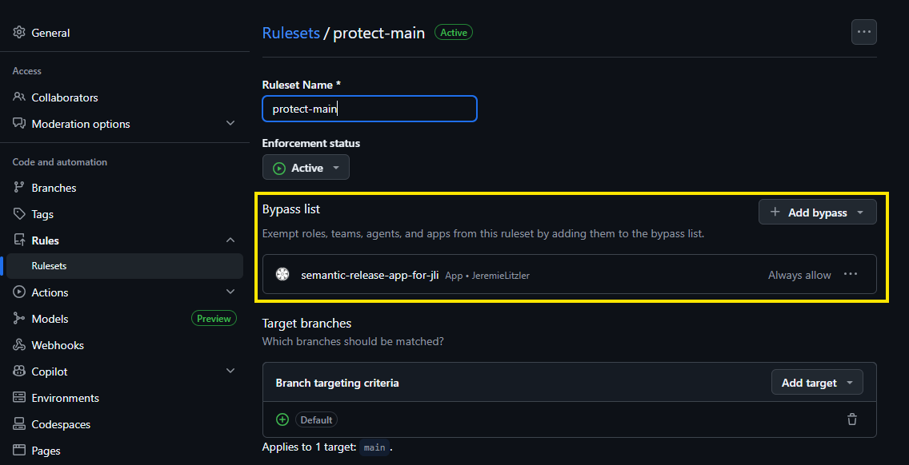

L’année dernière, j’ai créé une base pour des projets à base _Vue et Supabase_ pour mes projets personnels. À la même époque, j’ai eu un entretien avec un client pour lequel la publication sémantique était, et est toujours, très important.

Je connaissais déjà les validations conventionnelles et le versioning sémantique. La publication sémantique de versions logicielles est le résultat naturel de ces deux concepts et des bonnes pratiques.

## Présentation des validations conventionnelles

Les validations conventionnelles sont un format standardisé pour rédiger des messages de validation dans Git qui rendent l’historique de votre projet plus lisible et permettent l’automatisation à travers des outils. Ils suivent une structure simple : `type(scope): description`, où le type indique le type de modification que vous effectuez (comme `feat` pour les nouvelles fonctionnalités, `fix` pour les corrections de bugs ou `docs` pour la documentation), la portée facultative spécifie la partie du code concernée et la description explique brièvement la modification.

Le principal avantage est la cohérence au sein de votre équipe et de votre projet. Au lieu de messages de validation aléatoires tels que « *met à jour ceci* » (mises à jour) ou « *résoud cela* » (corrections), vous obtenez des messages clairs et structurés tels que `feat(auth) : ajout de la fonctionnalité de réinitialisation du mot de passe` ou `fix(api) : résolution de l'erreur de délai d'expiration dans le point de terminaison utilisateur`. Il est ainsi beaucoup plus facile de comprendre ce qui a changé et pourquoi lors de la lecture de l’historique du projet.

Au-delà de la lisibilité, les commis conventionnels permettent une automatisation puissante. Des outils peuvent générer automatiquement des journaux de modifications, déterminer les numéros de version (à l’aide du versioning sémantique) et même déclencher différents processus de CI/CD en fonction des types de validations. Par exemple, une validation `feat` peut déclencher une mise à jour mineure de la version, tandis qu’une validation `fix` déclenche une mise à jour corrective, le tout sans intervention manuelle.

## Présentation du versioning sémantique

Avant d’aborder le sujet de cet article, permettez-moi de vous présenter le versioning sémantique (SemVer). Il s’agit d’un système de versioning qui utilise trois nombres séparés par des points : `MAJOR.MINOR.PATCH` (comme 2.3.1) pour définir généralement une version logicielle.

Chaque chiffre a une signification spécifique : vous incrémentez _MAJOR_ lorsque vous apportez des modifications importantes qui ne sont pas rétrocompatibles, _MINOR_ lorsque vous ajoutez de nouvelles fonctionnalités de manière rétrocompatible et _PATCH_ lorsque vous corrigez des bogues de manière rétrocompatible.

Ce système crée un contrat prévisible entre votre projet et ses utilisateurs. Lorsque quelqu’un voit votre version passer de 1.5.3 à 2.0.0, il sait immédiatement qu’il doit s’attendre à des modifications importantes et qu’il doit examiner attentivement le journal des modifications avant de procéder à la mise à jour. Un passage de 1.5.3 à 1.6.0 signale de nouvelles fonctionnalités qu’il peut adopter en toute sécurité, tandis qu’un passage de 1.5.3 à 1.5.4 signifie simplement des corrections de bogues avec un risque minimal.

Passons maintenant de la théorie à la pratique.

## Utilisation de _Semantic Release_ sur GitHub

Lorsque j’ai décidé d’utiliser _Semantic Release_ l’année dernière, j’ai trouvé cet [excellent article](https://gonzalohirsch.com/blog/semantic-release-and-branch-protection-rules/). L’utilisation de Perplexity n’a pas fourni de solution viable, car il n’a pas été possible de trouver la solution expliquée par [Gonzalo Hirsch](https://gonzalohirsch.com/#). Merci à Google et aux compétences de recherche dont vous aurez encore besoin en 2026 afin de trouver l’article qui vous mettra sur la bonne voie.

Si vous suivez les étapes décrites par Gonzalo, vous pourrez facilement connecter votre référentiel GitHub à _Semantic Release_.

Une chose que je peux ajouter : vous trouverez les secrets du référentiel sous _Paramètres > Environnements > {Le nom de votre environnement} > Ajouter de nouveaux secrets_. Je vais vous expliquer à quoi cela sert.

## Commentaires supplémentaires sur `release.yml`

En ce qui concerne le fichier `release.yml`, voici mes commentaires basés sur ce que j’ai appris lors de la configuration.

### Clé de l’’environment`

Vous devez comprendre que cette clé fournit au processus l’information sur l’emplacement des secrets. Sans elle, vous obtiendrez des erreurs, principalement des erreurs `unauthorized`.

La valeur à définir est égale **au nom** que vous donnez à l’environnement dans l’onglet Paramètres de votre référentiel.

### Génération d’un jeton à usage unique

Pour garantir une sécurité optimale, Gonzalo recommande d’éviter l’utilisation de PAT (Personal Access Token).

C’est pourquoi nous utilisons plutôt une application GitHub pour exécuter la tâche de _Semantic Release_. Cela nécessite des étapes plus complexes, mais la sécurité est renforcée.

```bash
      - name: 'Generate token'
        id: generate_token
        uses: tibdex/github-app-token@v1
        with:
          app_id: ${{ secrets.GH_APP_ID }}
          private_key: ${{ secrets.GH_APP_KEY }}
```

Dans le cadre de cette tâche, vous utilisez l’ID d’application GitHub et sa clé privée. C’est ce que vous devriez avoir ajouté aux variables secrètes de votre environnement de référentiel.

Une même application GitHub peut contenir plusieurs clés privées. Par exemple, si vous oubliez la première clé privée que vous avez générée pour un premier référentiel, vous pouvez en ajouter une deuxième ultérieurement à usage pour un autre référentiel. Seul l’ID d’application restera le même.

## À propos de `.releaserc`

Un autre point que Perplexity a omis de mentionner était d’ajouter la valeur pour `repositoryUrl` dans ce fichier.

Je m’en suis rendu compte lorsque j’ai exécuté le workflow de publication pour la première fois.

```json
{
  "repositoryUrl": "https://github.com/YourUserName/YourRepoName.git"
  //... rest of the release config
}
```

Consultez la [documentation sur les versions sémantiques](https://semantic-release.gitbook.io/semantic-release/usage/configuration#repositoryurl) à ce sujet.

Si vous l’omettez, l’action GitHub ne s’exécutera pas.

## Exemple complet de configuration

Voici ma configuration complète :

- J’ai créé une application GitHub, comme l’a décrit Gonzalo.
- Je l’ai installée sur mon compte afin que tous les dépôts puissent l’utiliser.
- J’ai créé l’environnement `CI` dans mes référentiels cibles (l’URL doit être `https://github.com/{votre-nom-d'utilisateur-github}/{nom-de-votre-référentiel}/settings`) avec les secrets d’environnement `GH_APP_ID` et `GH_APP_KEY`. Vous pouvez obtenir l’identifiant de l’application GitHub et la clé privée dans [vos paramètres d’application GitHub](https://github.com/settings/apps). Comme je l’ai dit, vous pouvez avoir plusieurs clés privées pour une même application GitHub et utiliser une clé différente pour chaque référentiel.
- J’ai ajouté un fichier [`.release.yml`](https://github.com/JeremieLitzler/VueSupabaseBoilerplate/blob/main/.github/workflows/release.yml). Il définit les étapes de votre action GitHub et utilise les secrets d’environnement `GH_APP_ID` et `GH_APP_KEY` pour générer le token.
- J’ai ajouté le fichier `.releaserc` que les paquets de publication sémantique utiliseront pour créer les versions dont vous avez besoin. Par exemple, j’ai personnalisé le déclencheur de la création d’une nouvelle version et la manière dont j’inclus certains types de commis dans les notes de version. C’est ce que j’expliquerai [ci-dessous](#customization-of-release-trigger).
- J’ai ajouté un fichier `CHANGELOG.md`. C’est là que `semantic-release` stocke les modifications apportées au code.
- J’ai ajouté une règle de branche pour protéger `main` et `develop`, comme recommandé.
  - À cette étape, j’ai ajouté l’application GitHub à la liste _ByPass_ de la règle. Sans cela, l’action ne parviendrait pas à pousser la balise Git et la modification dans le `CHANGELOG` vers la branche.
    
- J’ai regroupé toutes les modifications de code pour les versions sémantiques dans une branche CI afin de les fusionner dans `main` et pouvoir les tester.

Une fois la PR validée, l’action s’exécute et, si la tâche de version sémantique estime qu’une nouvelle version doit être créée, c’est ce qui se passe.

## Comment le plugin `Semantic Release` filtre-t-il les validations

Notez que, par défaut, il ne créera pas une nouvelle version pour chaque validation. À moins que vous n’ayez un `BREAKING CHANGE`, un `feat` ou un `fix`, les commis peuvent ne pas être éligibles pour une nouvelle version.

J’ai remarqué ce fait lorsque j’ai effectué ma configuration pour activer la version sémantique et que j’ai effectué des validations avec le type `ci` uniquement.

### Déclencheurs de la première version majeure

Si le message de validation spécifie le type `feat`, la version sémantique déclenche une mise à jour mineure pour les nouvelles fonctionnalités.

Si le message de validation spécifie le type `fix`, cela déclenche une augmentation de version patch pour les corrections de bogues.

Si un `!` est trouvé après le `type(scope)` ou les mots `BREAKING CHANGE` dans les messages de validation, cela déclenche une augmentation de version majeure.

Cependant, les [spécifications _Convential commits_](https://www.conventionalvalidations.org/en/v1.0.0/) mentionnent [d’autres types](https://github.com/conventional-changelog/validationlint/tree/master/%40validationlint/config-conventional#type-enum), qui font partie du paquet [`@validationlint/config-conventional`](https://github.com/conventional-changelog/validationlint/tree/master/%40validationlint/config-conventional).

## Personnalisation du déclencheur de publication

Mais que faire si je dois déclencher une publication lors de mises à jour de dépendances ou de modifications importantes de la documentation ? J’ai trouvé [la réponse](https://github.com/semantic-release/semantic-release/blob/master/docs/support/FAQ.md#how-can-i-change-the-type-of-validations-that-trigger-a-release) dans la documentation du package `semantic-release`.

```json
{
    [
      "@semantic-release/validation-analyzer",
      {
        "preset": "conventionalvalidations",
        "releaseRules": [
          { "type": "docs", "scope": "README", "release": "patch" },
          { "type": "refactor", "release": "patch" },
          { "type": "style", "release": "patch" }
        ],
        "parserOpts": {
          "noteKeywords": ["BREAKING CHANGE", "BREAKING CHANGES"]
        }
      }
    ],
}
```

Avec cet exemple :

- Une validation contenant `BREAKING CHANGE` ou `BREAKING CHANGES` dans son corps sera considérée comme une modification majeure.
- Les validations de type `docs` et de portée `README` seront associées à une version `patch`.
  - Par exemple, la validation aurait pu être : `docs(README) : ajout d'un détail important`.
- Les validations de type `refactor` seront associées à une version `patch`.
- Les validations de type `style` seront associées à une version `patch`.

Notez que vous devez installer la dépendance de développement `conventional-changelog-conventionalvalidations` pour utiliser le préréglage `conventionalvalidations`.

Pour cela, vous devez également mettre à jour le `release-notes-generator` et installer un nouveau paquet :

```bash
npm i -D conventional-changelog-eslint
```

Vous pouvez désormais configurer le générateur de notes de version comme suit :

```json
[
  "@semantic-release/release-notes-generator",
  {
    "preset": "conventionalvalidations",
    "presetConfig": {
      "types": [
        {
          "type": "feat",
          "section": "Features"
        },
        {
          "type": "fix",
          "section": "Bug Fixes"
        },
        {
          // une nouvelle section est ajoutée
          "type": "docs",
          "section": "Others"
        },
        {
          // toutes les modifications de refactorisation accompagnent les documentations, par ordre chronologique
          "type": "refactor",
          "section": "Others"
        },
        {
          // toute validation avec un type de style n'apparaîtra pas
          "type": "style",
          "hidden": true
        }
      ]
    }
  }
]
```

Si vous vous interrogez sur la section _BREAKING CHANGES_, si l’une de vos validations contient `BREAKING CHANGE` ou `BREAKING CHANGES` ou `!`, les notes de version contiendront la mention « **⚠ BREAKING CHANGES** » en haut de la description de la version.

## À propos de la première version

Dans le cadre d’un nouveau projet, je pense qu’il ne faut pas commencer avec la version `1.0.0`, car vous venez de lancer le projet. Vous devez créer la première version majeure lorsque vous estimez que l'application est suffisamment stable pour cela.

J'ai donc pensé que l'ajout des règles suivantes à la configuration `releaseRules` ne respecterait pas ce qui est indiqué ci-dessous :

```json
          {
            "breaking": true,
            "release": "patch"
          },
          {
            "type": "feat",
            "release": "patch"
          },
```

Ci-dessus, vous empêchez toute modification radicale ou nouvelle fonctionnalité de générer cette première version majeure, jusqu'à ce que vous supprimiez ces deux règles.

Sans elles, vous revenez aux règles habituelles de versioning sémantique, équivalentes à :

```json
          {
            "breaking": true,
            "release": "major"
          },
          {
            "type": "feat",
            "release": "minor"
          },
```

Mais cela ne s'est pas produit lorsque je l'ai testé.

Bien que le package semantic release n'ait trouvé aucun « _The release type for the validation is major_ », il a tout de même utilisé par défaut une version majeure `1.0.0` comme première version, aucune version précédente n'ayant été trouvée.

Il semble donc approprié d'utiliser le script [`tag-release.sh`](https://github.com/JeremieLitzler/VueSupabaseBoilerplate/blob/develop/tag-release.sh) dans ce scénario.

Je recommande de configurer l'application GitHub, l'action GitHub et l'environnement lorsque vous effectuez cette première version majeure manuelle.

Ensuite, il suivra les `releaseRules` que vous avez définies dans `.releaserc`.

Je n’ai pas examiné en détail la configuration que je pourrais modifier pour empêcher l’étape de publication sémantique d’effectuer le comportement ci-dessus.

Pour l’instant, pour la toute première version, j’utiliserai le script `tag-release.sh`.

## Conclusion

Cela peut sembler fastidieux, mais cela vous fera gagner du temps lors de la publication de vos versions logicielles et vous évitera des erreurs. Vous pouvez désormais vous concentrer sur votre programmation et vos messages de validation.

Je pourrais vous expliquer comment configurer un linter pour les « messages de validation », mais ce sera le sujet d’un autre article.



Merci d’avoir lu cet article. Assurez-vous de [me suivre sur X](https://x.com/LitzlerJeremie), de [vous abonner à ma publication Substack](https://iamjeremie.substack.com/) et d’ajouter mon blog à vos favoris pour ne pas manquer les prochains articles.



Photo de [Kanhaiya Sharma](https://www.pexels.com/photo/while-ladder-attached-to-the-orange-wall-13062567/).
