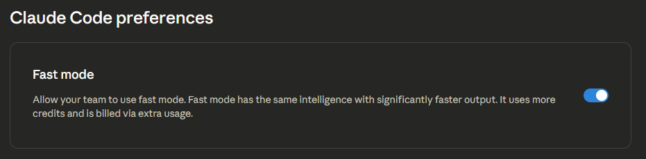

Depuis quelques mois, je souhaitais utiliser l’IA à un autre niveau. J’utilise des chatbots IA, principalement Claude.ai, depuis plus de deux ans, et je trouvais cela limitatif.

J’avais une idée d’application pour améliorer le temps que je passe à partager des articles de blog, comme celui-ci, sur les réseaux sociaux.

Je voulais également apprendre à utiliser le codage agentique grâce au développement basé sur les spécifications afin de rester à jour avec ce qui pourrait m’être demandé dans mon travail dans un avenir proche.

En effet, l’IA ne me remplacera peut-être pas, mais la façon dont nous construisons les solutions de demain s'en occupera et cela impliquera de plus en plus l’IA, en particulier par l’intermédiaire d’agents, autonome ou non.

J’ai donc commencé par soumettre mon idée au chatbot [Claude.ai](http://Claude.ai) et lui ai demandé :

```plaintext
suggére un plan pour enregistrer les spécifications lors de la création d'une application avec code claude.
toutes les spécifications doivent être écrites en Markdown et stockées de manière logique.
suggérer comment commencer si l'utilisateur dispose d'un brouillon des spécifications.
besoin de préserver les décisions, l'architecture.
besoin d'un bon prompt système et prompt d'espace de travail pour enrichir les prompts des tâches à mesure que le projet se développe.
```

Il m’a donné ce plan initial :

```jsx
project-root/
├── docs/
│   ├── specs/
│   │   ├── 00-overview.md          # Vision du projet, objectifs, utilisateurs cibles
│   │   ├── 01-requirements.md      # Exigences fonctionnelles et non fonctionnelles
│   │   ├── 02-architecture.md      # Conception du système, pile technologique, modèles
│   │   ├── 03-data-models.md       # Schémas de base de données, contrats API
│   │   ├── 04-ui-ux.md            # Flux d'utilisateurs, maquettes fonctionnelles, système de conception
│   │   └── 05-features/           # Spécifications détaillées par fonctionnalité
│   │       ├── auth.md
│   │       ├── dashboard.md
│   │       └── ...
│   ├── decisions/
│   │   ├── ADR-001-framework-choice.md
│   │   ├── ADR-002-state-management.md
│   │   └── README.md              # Index des ADR
│   └── prompts/
│       ├── system-prompt.md
│       └── workspace-context.md
│       └── tasks
│           └── task-001.md
│           └── task-002.md
│           ...
│           └── task-NNN.md
│           └── task-template.md
```

## Élaboration des spécifications, des ADR et de la liste des tâches

J’ai poursuivi avec :

```plaintext
Guide-moi pour mettre ça en place dans un nouveau projet.
J'ai un point de départ pour les spécifications dans le fichier README.
Allons-y étape par étape.
```

J’utilise toujours [Claude.ai](http://Claude.ai) pour l’instant, car j’avais besoin de comprendre la logique ci-dessus. J’ai suivi étape par étape la création de chaque fichier, en remettant en question et en ajustant le contenu et l’organisation des fichiers.

Au fur et à mesure que je progressais dans la construction de l’application, je m’assurais que Claude suivait le workflow de développement et suggérait un nouvel ADR au moment opportun. J’ai également ajusté les prompts systèmes et de l’espace de travail lorsque je constatais une lacune qui devait être enregistrée dans sa mémoire.

[Cette validation](https://github.com/JeremieLitzler/SocialMediaPublisherApp/tree/b4d7a11f5b6d4f38e3d3bafd112b905c29d74698/docs) vous montre à quoi ressemblait le dossier `docs` lorsque je me trouvai prêt à lancer la phase de codage. À ce stade, il suffisait de configurer Claude et de le lancer.

## Install Claude Code Usage Extension

Au début, connaître le coût d’utilisation de Claude Code me semblait essentiel pour maîtriser mes dépenses.

En fait, j’ai décidé d’essayer Claude Code via des crédits API simplement parce que je voulais vérifier les mesures réelles de mon utilisation et confirmer que la méthode des crédits API n’était pas rentable.

Sur la base de [cet article](https://dev.to/suzuki0430/prevent-unexpected-claude-code-costs-with-this-vscodecursor-extension-nlb) d’[Atsushi Suzuki](https://dev.to/suzuki0430), j’ai téléchargé et installé le code pour ajouter une extension Visual Studio Code me permettant de calculer le coût d’utilisation de Claude.

La configuration expliquée dans l’article est suffisante. Cependant, comme nous le verrons plus loin, la précision des coûts ne me satisfait pas.

## Installation de Claude Code

J’ai utilisé la [documentation officielle](https://code.claude.com/docs/en/quickstart). À l’aide de l’option **Windows PowerShell**, j’ai installé l’application Claude Code.

J’ai également dû ajouter le chemin d’accès `C:\Users\[votre_nom_d'utilisateur]\.local\bin` à ma variable d’environnement `PATH`, comme indiqué à la fin de l’installation.

J’ai terminé en redémarrant.

## Première connexion dans Visual Studio Code

Je voulais utiliser l’extension officielle Claude Code, mais, pour une raison que je n’ai pas résolue, je ne pouvais pas rester connecté. La connexion semblait réussir, puisque je me retrouvais redirigé vers `https://platform.claude.com`, mais dès que je tapais « Claude, es-tu prêt », l’extension me demandait de me reconnecter…

J’ai donc décidé d’utiliser le terminal intégré de VSCode et d’exécuter la commande `claude`.

Avant cela, j’ai dû ajouter la variable d’environnement, car j’utilise une installation Git personnalisée avec [scoop.sh](http://scoop.sh).

```plaintext
CLAUDE_CODE_GIT_BASH_PATH=/path_to_scoop/apps/git/bin/bash.exe
```

Après un nouveau redémarrage, je pouvais commencer à utiliser Claude Code...

## Initialiser le `CLAUDE.md`

Si vous disposez d’un bon point de départ décrivant succinctement votre projet dans un fichier `README` comme je l’ai fait, cela générera un fichier `CLAUDE.md` contenant les informations les plus importantes sur le projet à construire.

Comme toujours, veillez à lire **tout** ce que Claude Code a généré pour vous et **assurez-vous que cela vous convient**.

Par exemple, j’ai ajouté moi-même la définition de qui est Claude :

```markdown
## Qui est Claude Code ?

Il s'agit d'un ingénieur senior qui suit la stratégie Git Flow et propose des solutions performantes, sécurisées et propres.

Il doit créer :

- une branche de fonctionnalité lorsqu'il ajoute une fonctionnalité,
- une branche de correction lorsqu'il résout un problème,
- une branche de documentation lorsqu'il met à jour uniquement des fichiers Markdown.
- une nouvelle branche lorsqu'un fichier est modifié et qu'il ne correspond à aucun des trois scénarios précédents. Suivre les règles conventionnelles de commit et Git Flow pour nommer les branches.

Il planifie toujours les tâches et demande l'approbation avant d'écrire la documentation ou le code.
Il n'est pas nécessaire de confirmer la création ou la modification d'un fichier, mais de confirmer que le contenu convient à l'utilisateur de Claude Code.

Il n'est pas nécessaire de féliciter ou d'utiliser un langage qui utilise des jetons de sortie inutiles. Aller droit au but.
```

Lors de l’initialisation, Claude examine les fichiers de votre projet. Par exemple, j’utilisais le modèle Vue et Supabase Boilerplate que j’avais créé moi-même et j’ai donné à Claude des informations supplémentaires sur le modèle et ce que je devais conserver ou supprimer.

## Réalisation de la première tâche avec Claude Code

C’était le moment que j’attendais avec impatience. J’ai commencé par la tâche « **TR-1 : Nettoyage du code source** » prévue par Claude Code dans le fichier des exigences afin de m’assurer que le code restant du modèle Vue et Supabase que j’avais utilisé n’encombre pas le contexte de Claude Code.

Il a utilisé **457 657 jetons d’entrée** et **8 698** jetons de sortie d’une valeur de 1,08 $ (source : `https://platform.claude.com/usage`) pour accomplir la tâche.

Mais l’extension censée calculer le coût me donnait un coût assez imprécis…

```plaintext
│ Date       │ Input │ Output │ Cache Create │ Cache Read │ Total Tokens │ Cost (USD) │
├────────────┼───────┼────────┼──────────────┼────────────┼──────────────┼────────────┤
│ 2026-02-12 │ 1,224 │ 9,913  │ 489,119      │ 5,845,326  │ 6,345,582    │ $18.70     │
```

J’ai donc essayé [CLI `ccusage`](https://www.npmjs.com/package/ccusage) en exécutant la commande d’installation :

```bash
npx ccusage@latest
```

En exécutant ensuite `ccusage`, j’ai obtenu un résultat plus cohérent avec l’utilisation de Claude Console :

```plaintext
┌────────────┬───────────────┬───────────┬───────────┬───────────────┬─────────────┬───────────────┬─────────────┐
│ Date       │ Models        │     Input │    Output │  Cache Create │  Cache Read │  Total Tokens │  Cost (USD) │
├────────────┼───────────────┼───────────┼───────────┼───────────────┼─────────────┼───────────────┼─────────────┤
│ 2026-02-12 │ - sonnet-4-5  │       256 │       117 │        88,764 │   1,288,053 │     1,377,190 │       $0.72 │
└────────────┴───────────────┴───────────┴───────────┴───────────────┴─────────────┴───────────────┴─────────────┘
```

Le résultat s’avère inférieur de plus de 30 % que la réalité, mais il s'approche des statistiques de Claude Console que de celles de l’extension.

Après les tâches 2 à 8, j’ai atteint 13,80 $, tandis que l’interface CLI `ccusage` m’indiquait que j’avais dépensé 10,44 $, soit une différence de 32 %. J’envisage probablement signaler cela à l’équipe `ccusage`.

Mais après avoir lu quelques articles sur leur dépôt GitHub, je me rends compte qu’il semble très difficile de calculer un chiffre précis et qu’Anthropic peut modifier les règles sans que personne ne sache vraiment quand et comment exactement.

## Passons à l’exécution des tâches

Je trouvais que le flux de travail suggéré par [Claude.ai](http://Claude.ai) n’était pas idéal. Je devais créer un fichier par tâche et noter moi-même la tâche.

Mais que se passerait-il si je pouvais simplement laisser Claude Code déterminer les tâches à partir des exigences, me demander de revoir le plan qu’il suivrait, puis le lancer pour accomplir la tâche ? N’oubliez pas : je débutais avec Claude et je ne connaissais pas encore le « mode plan »…

Pour cela, je devais indiquer le flux de travail à suivre dans le fichier de prompts systèmes. J’y ai donc ajouté que Claude Code devait suivre l’approche Git Flow et créer lui-même les tâches.

Au fur et à mesure que je progressais dans la mise en œuvre,

- j’ai examiné le code et la logique mise en œuvre.
- J’ai suggéré d’ajouter des tests au projet avant que Claude ne code quoi que ce soit, en créant un nouvel ADR avec le cadre que je préférais.
- J’ai suggéré des améliorations aux prompts systèmes en cours de route, en m’assurant que Claude suivrait bien Git Flow (ce qui n’était pas le cas au début) lors de la création de branches et de validations. Il faut être précis et ne pas supposer que l’AI sait tout.
- J’ai laissé à moi-même le soin de pousser les branches et de réviser les PR.
- Une fois, après avoir ajouté des tests pour les composants Vue, j’ai remarqué un problème que Claude n’avait pas vu. Il est absolument nécessaire de réviser les résultats des tests, même s’ils sont réussis. Dans ce cas, le test des composants échouait sur les appels `fetch`, ce qui n’avait pas d’impact sur les résultats réels du test, mais polluait les résultats dans l’action GitHub.

## Claude n’a pas toujours raison

Oui, c’est ce que vous indiquent les mentions écrites en petit lorsque vous lancez Claude Code ou utilisez n’importe quel chatbot.

Il m’assurait qu’une SPA conviendrait et qu’il n’y aurait aucun problème CORS pour récupérer le contenu HTML à partir de l’URL fournie alors que nous le servions sur un domaine différent.

Je savais que cela ne fonctionnerait pas, mais j’ai continué pour voir si Claude s’en rendrait compte. Il a même ajouté des tests pour le problème CORS, ce qui est drôle, étant donné qu’il m’avait d’abord dit qu’il n’y aurait pas ce genre de problème.

C’est alors que j’ai explicitement posé la question et qu’il m’a suggéré l’[ADR 6](https://github.com/JeremieLitzler/SocialMediaPublisherApp/blob/develop/docs/decisions/ADR-006-netlify-functions-for-cors-proxy.md) concernant l’utilisation des fonctions sans serveur Netlify comme backend proxy. Cela a très bien fonctionné.

## À propos de l’utilisation de Claude Code avec des crédits API

**Claude Code continuera à fonctionner même si vous épuisez vos crédits pendant une invite.**

Je n’ai rien trouvé qui permette de l’interrompre à partir d’un certain solde restant… J’ai donc dû acheter 6 $ de crédits supplémentaires pour couvrir le solde négatif de 0,57 $. Je n’avais pas activé le rechargement automatique, car je savais que cela me serait facturé sans que je m’en rende compte…

Deuxièmement, en cherchant un paramètre pour interrompre le service dès que les crédits seraient épuisés, j’ai vu cette option sur « https://platform.claude.com » :



Je me demande si mes crédits se sont épuisés plus rapidement à cause de cela et combien de crédits supplémentaires le mode rapide utilise réellement… Peut-être que la différence de 30 % vient de là ? En attendant, une [recherche Google](https://www.google.com/search?q=claude+code+fast+mode+vs+no+fast+mode) peut peut-être nous aider à trouver la réponse.

À partir de là, je suis passé à l’abonnement Claude Pro.

## Utilisation de Claude Code avec Claude Pro

Même si l’application que je développe est petite, la fenêtre de session de 5 heures peut atteindre 100 % très rapidement (en moins de deux heures).

C’est là qu’une bonne gestion du contexte est essentielle.

## Optimisation des jetons

### Les bases

Chaque fois que vous utilisez Claude Code, ce que vous fournissez, qu’il s’agisse d’un prompt textuel, de fichiers de code ou autres, Anthropic le comptabilise comme vos jetons d’entrée. Tout ce que LLM répondra ou toute action qu’il effectuera sur votre base de code sera comptabilisé dans le compteur de jetons de sortie.

Et, quel que soit votre mode de facturation, abonnement ou crédits API, nous dépensons des jetons. Les crédits API donnent une vue claire des jetons dépensés, mais [les limites d’abonnement ne sont pas aussi claires](https://support.claude.com/en/articles/11647753-understanding-usage-and-length-limits).

Même si les LLM sont sans état, l’intégralité de la conversation en cours est conservée « en mémoire » et chaque fois que vous demandez quelque chose à Claude Code dans votre IDE, l’intégralité de la conversation est prise en compte dans votre limite…

### Astuce n° 1 : commande Clear

Lorsque vous avez terminé une tâche, utilisez la commande `/clear` pour repartir de zéro.

Si certains éléments de la conversation précédente peuvent s’avérer utiles pour la suite, la commande `/compact` peut vous aider à réduire l’utilisation de jetons tout en conservant le contexte pertinent.

### Astuce n° 2 : soyez précis dans votre champ d’application

Laisser Claude Code vagabonder librement dans votre base de code utilisera des jetons plus rapidement que vous ne le pensez.

Et souvent, Claude n’a pas besoin de lire tous les fichiers de chaque tâche sur laquelle il travaille. Si vous avez préparé vos tâches en petites unités fonctionnelles, indépendantes les unes des autres, le contexte de chaque tâche sera réduit.

De même, lorsqu’un bug survient, examinez-le d’abord vous-même, en réduisant la portée et en suggérant l’emplacement du code incriminé, et Claude Code se chargera de l’examiner.

### Conseil n° 3 : utilisez les sessions de 5 heures comme un sprint

C’est quelque chose que je n’ai pas encore appliqué, mais dont j’ai pris conscience grâce à mon expérience d’un workflow multiagent (que je partagerai dans un prochain article).

Un sprint est une liste de tâches, clairement définies, qu’une équipe doit accomplir dans un certain laps de temps, généralement quelques semaines. Ici, Claude Code dispose d’une fenêtre de cinq heures pour utiliser un certain nombre de jetons et accomplir les tâches. J’ai constaté que, d’une tâche à l’autre, les jetons disponibles s’épuisent plus rapidement ou en plus petite quantité, sans que je puisse déterminer exactement ce qui fait la différence dans un sens ou dans l’autre.

### Conseil n° 4 : changez de modèle de manière stratégique

Le modèle Opus est idéal pour la planification ou le débogage approfondi, mais il épuisera rapidement vos jetons lors du codage ou des tests.

Le modèle Sonnet est idéal pour exécuter le plan.

### Conseil n° 5 : utilisez le MCP à bon escient

Le MCP peut booster le LLM, mais parfois, en utiliser trop peut alourdir votre fenêtre de contexte.

L’idée est de cibler le MCP en fonction de la tâche et de limiter les outils que le LLM utilisera pour une tâche donnée.

Ce sera le sujet d’un prochain article.

## Conclusion

Claude Code est génial. J’ai créé deux applications complètes (dont [l’application de partage social](http://share.madebyjeremie.fr/)) avec cet outil, et elles fonctionnent très bien. J’ai déjà implémenté plusieurs nouvelles fonctionnalités par rapport à l’idée initiale.

J’ai l’impression de pouvoir me concentrer davantage sur les idées et l’ajout de fonctionnalités à mon application.

J’ai également appris de nouveaux concepts, comme le BFS, c’est-à-dire _Breadth-First Search_ en anglais ou la [recherche en largeur](https://en.wikipedia.org/wiki/Breadth-first_search).

L’abonnement Pro me suffit pour l’instant, mais je vous expliquerai bientôt, dans le prochain article, qu’il est plus efficace de disposer d’une équipe d’agents pour accomplir les tâches.

Restez à l’écoute.



Merci d’avoir lu cet article. Assurez-vous de [me suivre sur X](https://x.com/LitzlerJeremie), de [vous abonner à ma publication Substack](https://iamjeremie.substack.com/) et d’ajouter mon blog à vos favoris pour ne pas manquer les prochains articles.



_Photo de Alex Knight sur Pexels._
