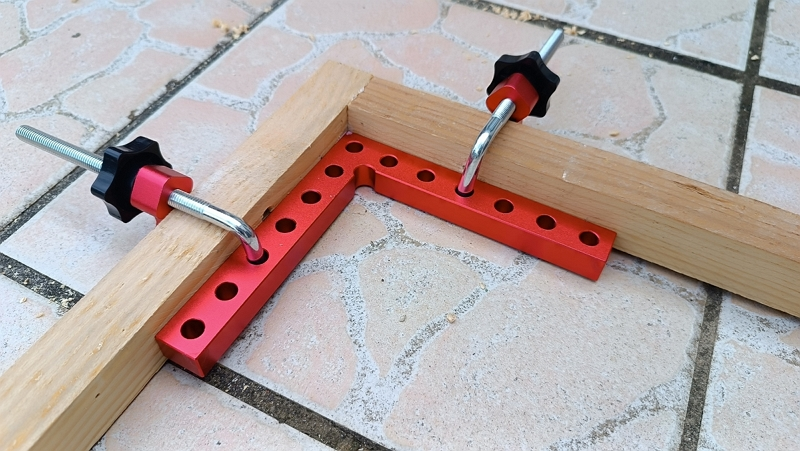
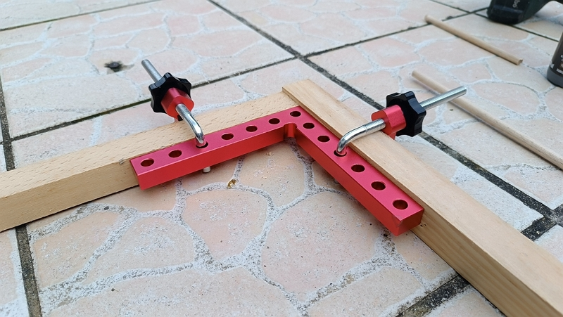

Il y a un an exactement, [j’ai partagé la technique](../../2025-06/moustiquaires-faits-maison/index.md) que j’ai utilisée pour réaliser des moustiquaires à partir de tasseaux de récupération.

Ça a fonctionné, mais, j’avoue que ce n’était pas simple, surtout lorsqu’on doit réaliser un grand nombre de cadres.

Cette année, je continue mon projet (car je dois encore construire pas mal de cadres) et je suis tombé sur des équerres qui pourraient simplifier la mise en œuvre.

## Le produit

Pince à angle droit, étau d’établis à 90 degrés type L, presses d’angles serre-joints, on peut leur donner plusieurs noms.

Je l’ai payé 39,99 euros sur Amazon il y a 2 mois.

Il y a dans le lot :

- 4 équerres de grande taille (14 x 14 cm)
- 8 vis en forme de L avec filetage de qualité
- 8 écrous noirs de bonne taille pour faciliter une bonne prise en main et un serrage fort
- 8 rondelles
- 8 blocs fixes réglables avec patin

## Premier usage

J’ai réalisé sans souci 2 cadres avec ces équerres. La prise en main est bonne et la qualité est là. L’épaisseur assure un bon maintien sur des tasseaux de 48x48.

Toutefois, la première remarque : il faut que l’équerre soit alignée avec le haut ou le bas de la pièce (selon si la vis se trouve respectivement au-dessus ou en dessous de la pièce en bois).

Pourquoi ? Si l’équerre se trouve trop bas, la vis en L ne permettra pas de tenir correctement l’équerre.

Par exemple, dans le cas ci-dessous, l’équerre se trouve trop basse.

Dans ce second cas, l’équerre est bien positionnée.

## Mon avis

Je suis satisfait de mon achat et, clairement, je préférerai ces équerres à ma technique de 2025. Après, c’est toujours utile de connaitre plusieurs astuces.

Et vous, comment réalisez-vous vos cadres en bois ?



Merci d’avoir lu cet article. Assurez-vous de [me suivre sur X](https://x.com/LitzlerJeremie), de [vous abonner à ma publication Substack](https://iamjeremie.substack.com/) et d’ajouter mon blog à vos favoris pour ne pas manquer les prochains articles.



Crédit : image extraite sur la page produit d'Amazon, vendu par Showmore EU.
